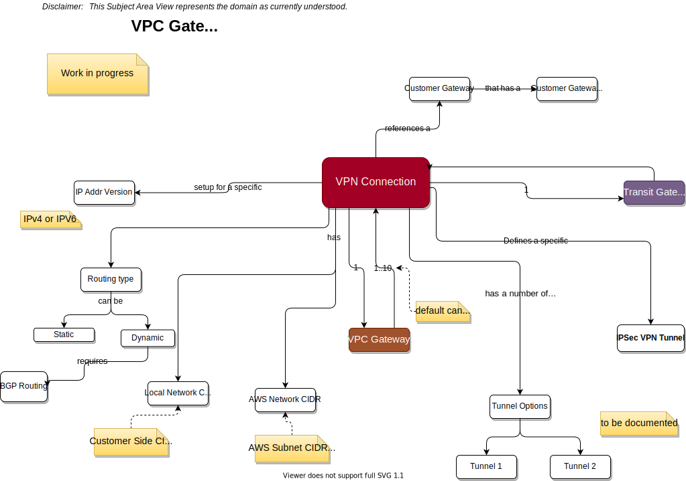
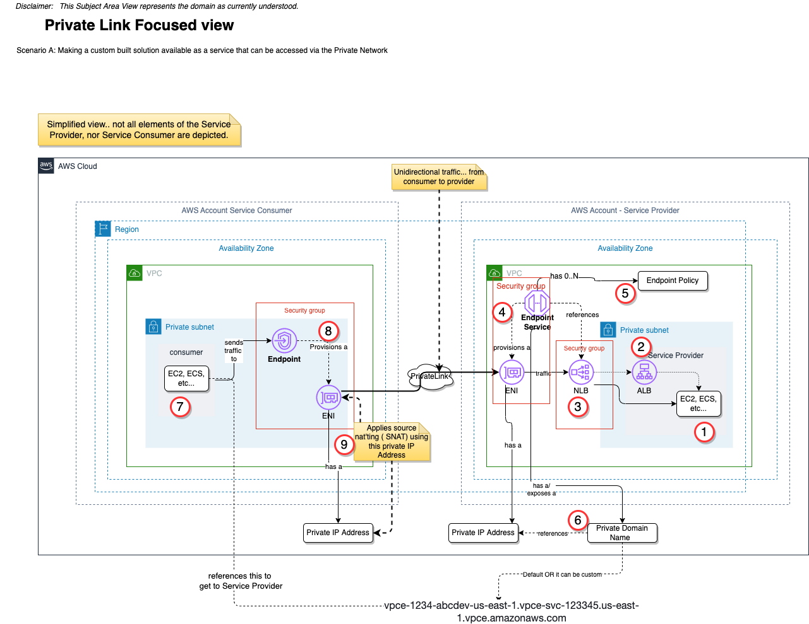

# Networking
Last Updated: {{ git_revision_date_localized }}

**Ongoing iterations and edits underway**

## Purpose
The focus of this page is AWS inter-networking between VPCs and to/from customers networks.

## Table of Contents
* [Connectivity Options](#Connectivity)
* [VPN Deep Dive](#vpns)
* [Some Patterns](#patterns)

---
## VPC Connectivity Options 
Focus on Connectivity

### Key Points relative to the following picture
1. When VPC Peering is enabled between 2 VPCs a network connection is setup that enables traffic to be routed between the VPCs over the __private network__. Instances in either can communicate as though they were in the same network.
    1.  VPC Peering can be between 2 VPCs in one account or between VPCs in multiple accounts
    2. The VPCs that are peered can also be in different regions. ( Inter-Region Peering). Stays on AWS Backbone thus no traffic charges. All traffic is encrypted.
    3. The owners of both VPCs must agree to peering.
    4. Requires Route Table configurations in both VPCs
    5. May require configuration changes to the Security Groups.
    6. Note: Make sure you enable DNS Host Resolution for the peered VPC connection. If you don’t, and reference a domain name of a service in the peered VPC, the traffic will go out through the public network.
2. VPC Endpoint:  
    1. What is this?  Enables you connect your app/workload running in one VPC with a) supporting AWS Services ( e.g. S3 ) , OR b) services hosted in OTHER accounts , OR c) supported AWS Marketplace services  ALL over the __Private Network__.
    2. Why is this key?  Simply put it simple. You don’t need any of the following: internet gateway, NAT device, public IP address, Direct Connect connection, or Site-to-Site VPN connection
    3. Where do you set this up?  You deploy a VPC endpoint in the source VPC that you want to communicate from and configure it to post to a target service.  When creating the VPC Endpoint you specify
        1. what service to connect to….
        2. the subnets in the VPC that should have connectivity….  ( crosses AZs)
        3. the security group to use
        4. and the access policies to control the flow  [VPC Endpoint Policies]
    4. The Interface endpoint is assigned a private IP Address so all outbound traffic over the private network will have this IPAddr as the source IP.
3. Endpoint Service:
    1. What is this?  This enables applications within your VPC to be exposed as an endpoint that OTHERs can call … just like AWS Services from above.
    2. Why is it Key?  Enables access to services you create via the __Private Network__
    3. Where do you set this up?  You set this up in your VPC…. BUT note you also need to create/use a load balancer in your VPC where the traffic will come through. These LBs are of type Network Load Balancer or Gateway Load Balancer.
4. Virtual Private Gateway:  …
    1. What is this?  The AWS side of a VPN tunnel between a VPC and the other end of a VPN tunnel.
    2. Why is it key?  This is where IPsec VPN tunnels will be configured on the AWS side.
    3. Where do you set this up? An instance of a Virtual Private Gateway is setup independent of a VPC, BUT… it must be attached to a VPC.
    4. Other options:
        1. There are other options to enable connectivity with clients. Specifically the `Customer Gateway` and a `site to site VPN` connection.
5. Incoming VPN Connections:
    1. What is this? The server side of a VPN Endpoint that can be configured within your VPC to support incoming VPN connections. Specifically from a [VPN Client[(https://www.techopedia.com/definition/30749/vpn-client-software)
    2. Why is it key? If you want to support users to connect directly to your VPC ( i.e. to ssh into an EC2 instance) from their laptop, AND you only want this done via a VPN connection started on their laptop, then you need a VPN Server
    3. Where do you set it up? You create a VPC Client VPN Endpoint in the context of your VPC.
    4. Options:
        1. You can use the VPC Client VPN Endpoint Or deploy your own VPN Server using an EC2 instance and install VPN server software on it. NOTE: make sure you properly configure security groups, firewalls, etc.. to only allow traffic from the clients you want to let in.
6. Direct Connect:  …
7. Direct Connect Gateway:  …
8. Transit Gateway: Controlled connections between multiple VPCs and/or client networks via VPN or Direct Connect.

__NOTE: You can right click on the image and download it. Each diagram is an SVG file created using DrawIO. That means you can edit the downloaded file with DrawIO__

---
## Deep Dive into VPNs 

---
## Some example connectivity Patterns 

### Using Endpoints and Endpoint Service

[Supporting Information](https://d1.awsstatic.com/whitepapers/aws-privatelink.pdf)

_Walkthrough_

1. The application/solution that will provide the service for others to access over the private network. This solution can be deployed in a single AZ, Multi-AZ, etc...
1. It can be accessed via an option Application Load Balancer.
1. In order to be accessed via a VPC Endpoint Service an NLB needs to be provisioned in front of the solution. ( Note a Gateway Load Balancer can also be used, but that will be covered in a separate pattern. )
1. An Endpoint Service is provisioned in the context of the VPC where the solution lives. When provisioned it references the NLB from above and a managed Elastic Network Interface ( ENI ) is provisioned in the VPC. This ENI connects to the network and exposes a private IP Address.
1. Access to the Endpoint Service _can be_ controlled via Endpoint Policies that define what can access this service. [More Information](https://docs.aws.amazon.com/vpc/latest/privatelink/vpc-endpoints-access.html#vpc-endpoint-policies) . This complements the Security Group ( default or custom ) that is associated to the ENI.
1. The Endpoint Service also exposes and registers a private DNS entry by which the service can be referenced by the Service Consumer.
1. The Service Consumer accesses the Service Provider via...
1. An VPC Endpoint (vs. Endpoint Service) that is configured in the VPC of the consuming solution. When a VPC Endpoint is provisioned it creates an ENI that also has a private IP Address.
1. This Private IP Address becomes the `source IP` that is applied to all messages sent to the Service Provider. In other words, it performs Source Natting (SNAT). This is to address conflicting IP addresses in the consumer and provider VPC.

