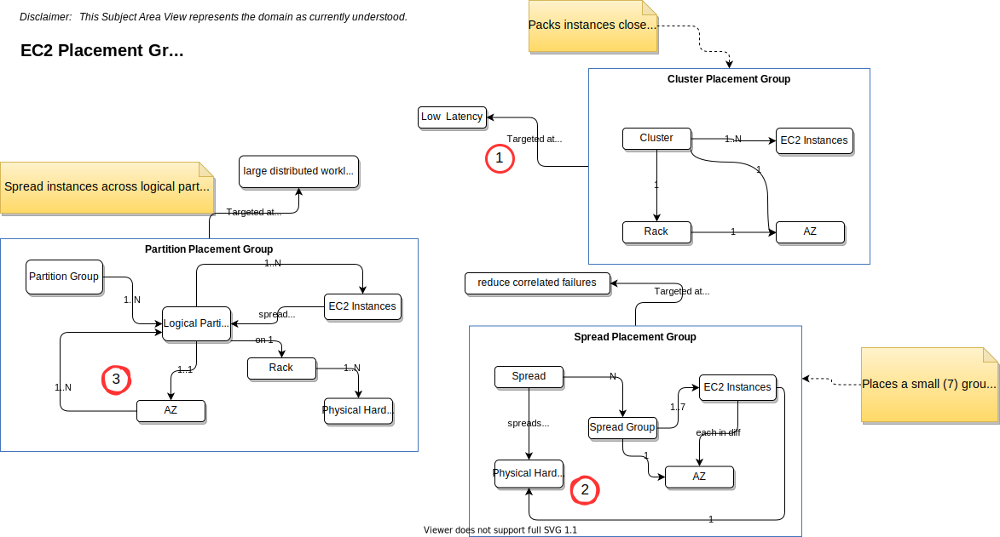

# Placement groups
Last Updated: {{ git_revision_date_localized }}

## Some Key Points relative to the picture above
1. SAME Rack, SAME AZ...  shortens the distance between EC2 Instances
1. A group of EC2 Instances (i.e. the `Spread Group`) is placed in the SAME RACK, but each Spread Group is placed on different racks, each with it's own network and power to reduce risks.  A Spread Group is in one AZ, but you can have multiple Spread Groups, each in different AZs.  ONLY 7 EC2 instances can be in a Spread Groups
1. Partition Placement allows you to partition your app into groups that can be spread across AZs. EACH Partition has has its own power and network. Thus, you can use partitions to divide up an HA service in your app so that each HA instance runs in it's own environment. If you loose 1 partition the app will keep running. 

__NOTE: You can right click on the image and download it. Each diagram is an SVG file created using DrawIO. That means you can edit the downloaded file with DrawIO__
