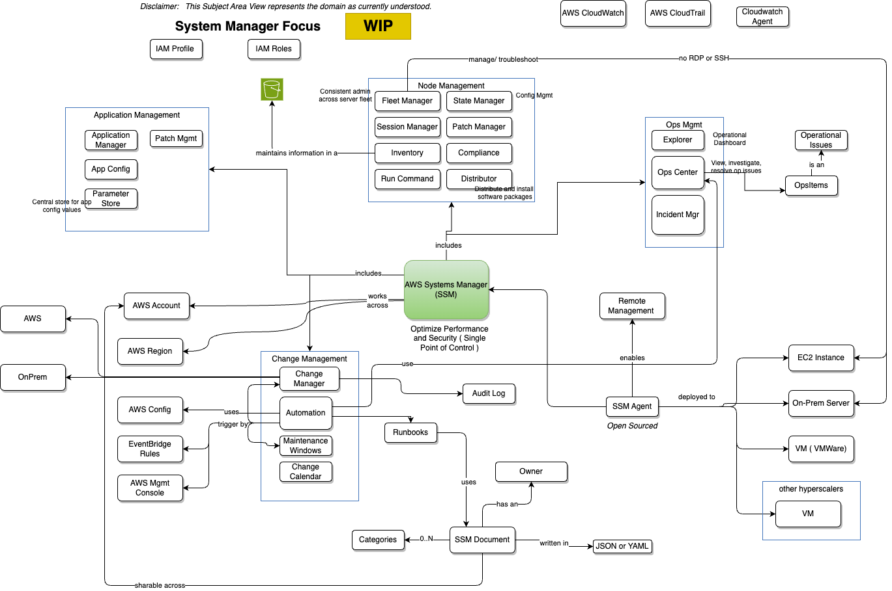

# Centralized Operations Management
Last Updated: {{ git_revision_date_localized }}

## Table of Contents
* [Overview](#overview)
* [System Manager](#sysmgr)
* [Mgmt Lens](#lens)
* [Session Manager](#system-manager)
---
## Overview   

---
## Systems Manager Focus 

## Lens Overview - Management and governance  

---
## System Manager - Session Manager   

