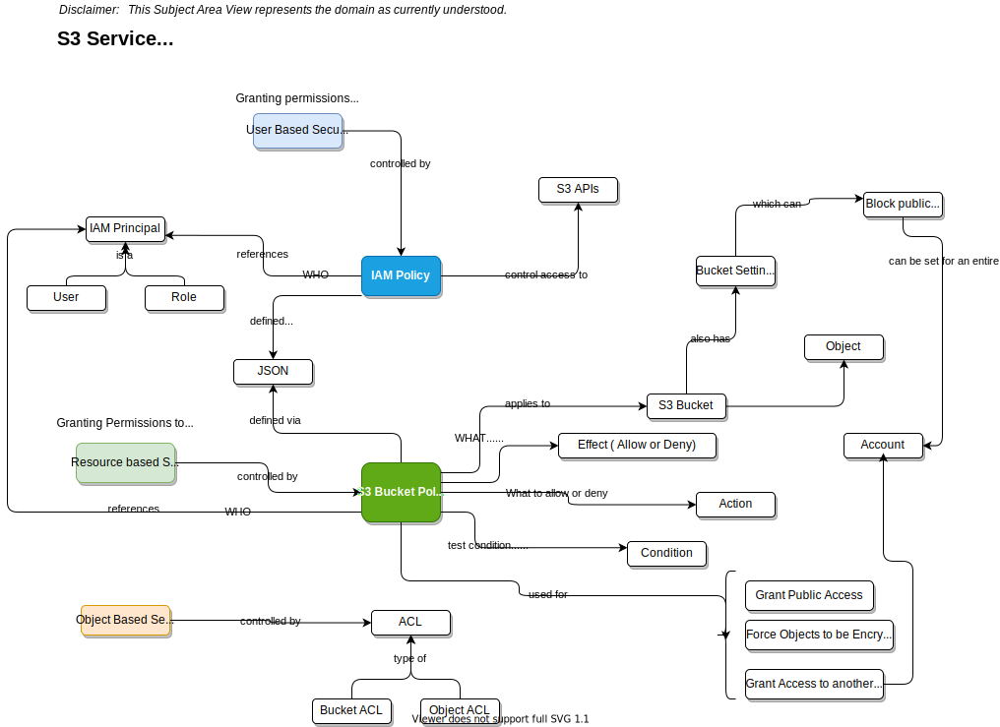

# S3 Object Storage
Last Updated: {{ git_revision_date_localized }}

## Table of Contents
* [Big Picture](#BIG)
* [IAM and Bucket Policies](#Policies)
* [Storage Tiers](#Tiers)

---
## The Big Picture 

__NOTE: You can right click on the image and download it. Each diagram is an SVG file created using DrawIO. That means you can edit the downloaded file with DrawIO__

## A Focused View into IAM and Bucket Policies 

## A Focused View into S3 Storage Tiers 

