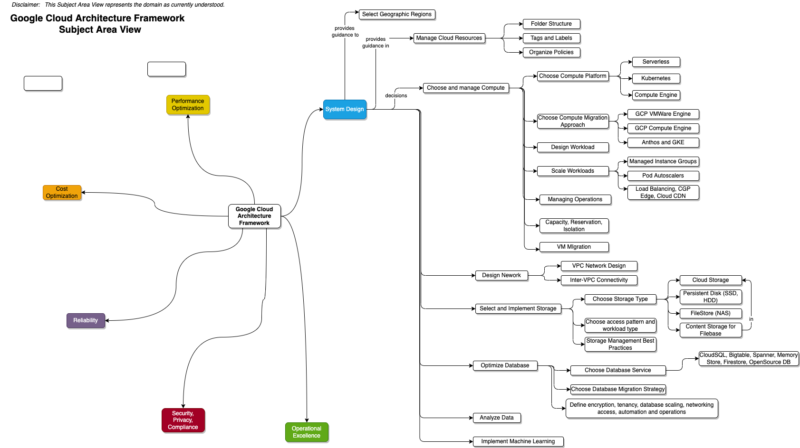

# Google Cloud Architecture framework
Last Updated: {{ git_revision_date_localized }}

__NOTE: You can right click on the image and download it. Each diagram is an SVG file created using DrawIO. That means you can edit the downloaded file with DrawIO__
