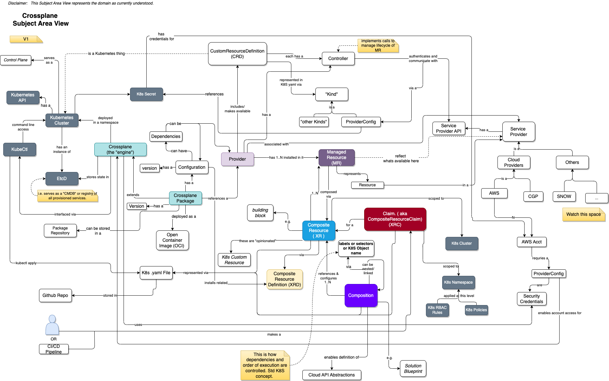
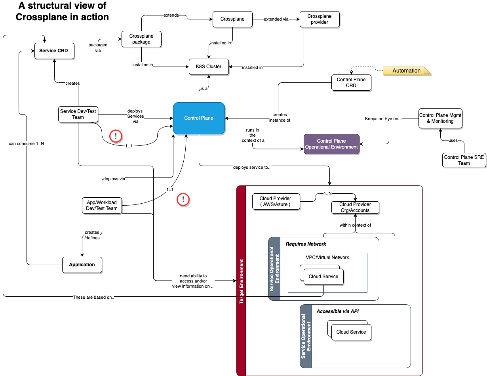
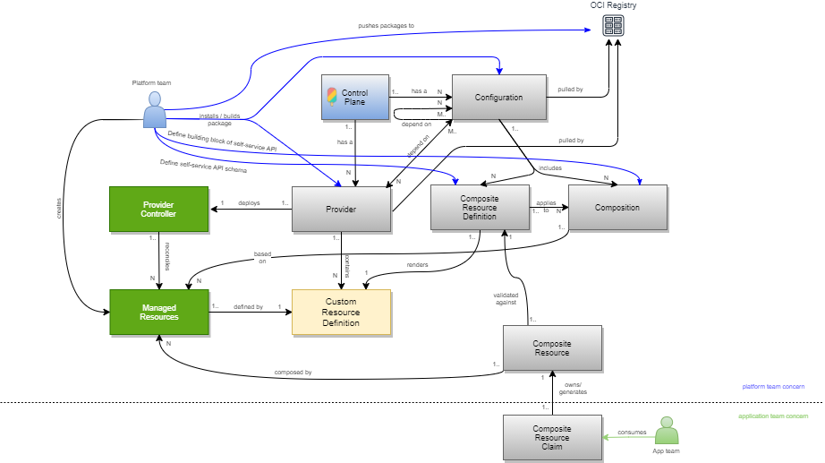

# Crossplane IaC Subject Area View

## Key Points
1. This is a **Declarative Approach** that builds on how Kubernetes works.
1. Think _Build Blocks_ !!   and _Bill Of Materials_
1. All *Services* required to fulfill the _Bill Of Materials_ must be accessible via APIs AND a Crossplane Provider needs to be created to access those services. For Example:
    1. If, as resources are provisioned they need to be registered in a corporate CMDB
    1. the IP addresses need to be pulled from an IPAM ( IP Address Management ) service
    1. key APIs for an app need to be registered in an API Gateway service
    1. an audit log service
1. Note that because this is a following a Declarative solution, the calls to providers not only includes the creation, it will also include all updates AND deletions from those services IF the service provides the API.
1. Existing declarative specifications ( e.g. Helm Charts ) can be leveraged in this approach.
1. Creating Crossplane XRDs requires a good understanding of the provider you are working with AND K8S CRDs.
1. ALL Resources created via Crossplane ( e.g. Compositions, CompositeResourceDefinitions, ManagedResourceDefinitions... ) are registered in the Kubernetes EtcD service running in the context of the K8S cluster that is serving as the Control Plane.  THUS... it becomes a "CDMB" that has a information on ALL resources provisioned and active.

---
## Connecting the dots from a usage standpoint
Thanks to Georgios Anastasiou ( Georgios.Anastasiou@kyndryl.com ) for the picture below.

---
## Supporting Information and/or Good links
The following are some of the links I used to build out my understanding.

* https://www.youtube.com/watch?v=78xR7ypzB4Q
* https://www.youtube.com/watch?v=yrj4lmScKHQ
* https://www.youtube.com/watch?v=AV3x0t5peQI
* https://www.youtube.com/watch?v=IVKs2rUDloU&t=1211s
* https://github.com/crossplane-contrib/provider-kubernetes/blob/main/examples/in-composition/composition.yaml
* https://github.kyndryl.net/MCMP-DevOps/argocd-pipeline/blob/master/applications/shared/test1-aws-montreal/mcmp-test1-aws-montreal.yaml
* https://github.com/upbound/platform-ref-multi-k8s
