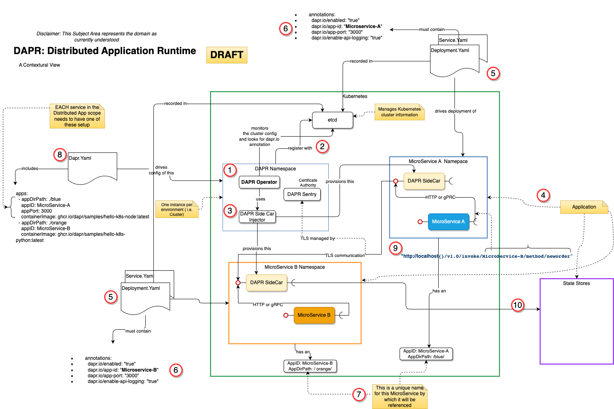

# What is DAPR?

## Purpose
This "mini-blog" focuses in on DAPR. DAPR, which stands for Distriuted Application Runtime", is a CNCF Incubation Project.  (dapr.io)  DAPR was contributed by Microsoft.

Per the website, ... _"Dapr provides integrated APIs for communication, state, and workflow. Dapr leverages industry best practices for security, resiliency, and observability, so you can focus on your code."_

The goal is to answer the following questions here.

* What is "DAPR"?  ( hint:  "Distributed Application Runtime)
* What value does it provide?
* How does it work? .. especially in the context of Kubernetes. 
* If I use this, what are the implications to my application?
* Why would I use DAPR?

## Background
Before diving in, I thought it valuable to highlight some key observations that have come to light as I've been investigating DAPR.

1. For those of you that have read through my Microservices blog posts on this site, you may notice, if you "squint" long enought my thoughts of a ["Butler Service"](../microservice-blog/alfred.md) to the role of DAPR.  Take a look. 
1. In order to understand how DAPR works, it helps to understand *Operators*. I have a view that has been documented [HERE](../common-notes/operators.md), that MAY help. [ still needs some cleanup work.]
1. Finally, in order to understand how DAPR works within a Kubernetes cluster, it is important to have a good understanding of [how kubernetes works](../common-notes/how-k8s-works.md).  Again, another point of reference. 

## Key Points relative to how it is used in Kubernetes

### The Structure and relationship of the pieces
The following walks throught the major points in the picture below.

1. First, DAPR is deployed within a Kubernetes (K8s) Cluster. This needs to/should be done before you start to provision your application into the cluster.  The DAPR system pods ( it's all containerized ) run in there own namespace. 
1. Like all other services deployed in K8s, the DAPR services register themselves with the cluster and their state is managed in the etcd service. DAPR is an Operator driven service. Hence, the DAPR Operator monitors etcd for situations where applications indicate that they want to use utilize DAPR to enable communicate between microservices, and other services. The later will be discussed in the next section.
1. When the Operator notices that the use of a DAPR sidecar is requested, it leverages a sidecar injector to add the container to the Pod registered to use it. 
1. Applications are made up of 1 to N MicroServices, and potentialy supporting services, working together. 
1. K8s knows about the application configuration using the Kubernetes Deployment and Service YAML files.
1. In order to register interest to use DAPR, the Deployment.Yaml file needs to add a specific annotation that indicates interest in DAPR, and helps DAPR know what the MicroService is.   This is registered within the etcd service and noticed by the DAPR Operator.
1. It is important  to note that for all this to work, you need to define names and paths for each MicroService. 
1. Simply naming things is not enough, DAPR does need to have an understanding of the App Microservices. Specifically the names you have assigned. Remember, it is going to be the "butler" ( per my earlier blogs ). In order to properly route work and help connect services, it needs to know the names, along with other important information. This is done in the YAML that configures the DAPR system in your K8s Cluster.
1. When using DAPR, the MicroServices call each other via the sidecars running in the same pod. The request is directed to the sidecar using the name of the target Service. DAPR will faciliate this communication flow, passing the payload, via an HTTPS or GRPC connection. It also enforces certificate (TLS) based communication. 

### A Walkthrough of the flow: examples

Placeholder

## Why should I use DAPR? 
_Some_ views on why DAPR is helpful:

1. Provides a more configuratble and flexible approach to integrating microservices AND supporting services (e.g. "Components" )
1. Founded on an application topology based approach. 
1. Can be used to reduce hard dependencies between microservices. How: they just reference a name of a microservice. DAPR does the rest.
1. Is an enabler of security between microservices. i.e. the mTLS connections.
1. Centered on enabling an event driven, microservices architecture. 
1. Fully declarative approach. ( YAML driven )
1. Enables flexibility interacting with services within Kubernetes and services running outside of Kubernetes.
    1. can substitute implementation simply by changing configuration
1. Sidecar architecture limits the embedding of libraries etc...  [ Non-Invasive ]

## What this means to applications? 

If an application architect wants to leverage the use of DAPR there some implications relative to the application architecture. These include, but are not limited to....

1. You are required to leverage a DAPR SDK in your app to enable access to DAPR Building Blocks
1. The DAPR operator, and supporting services need to be running in your Kubernetes cluster.
1. You need to layout a naming standard for your app so that your MicroServices can issue calls to other microservices using the app names
    1. It will probably help to create a component model view 
1. You will be adding additional resource consumers to your K8S cluster. ( DAPR system and sidecars )

## Supporting Information
* https://dapr.io
* https://youtu.be/mBgQBMhboyU?si=j4GAi-2LJEgKdw8d
* https://www.techtarget.com/searchitoperations/tutorial/Use-Dapr-on-Kubernetes-to-build-microservices-in-production
* https://docs.dapr.io/operations/hosting/kubernetes/kubernetes-overview/
* https://github.com/dapr/quickstarts/blob/master/tutorials/hello-kubernetes/README.md
* https://github.com/dapr/quickstarts/blob/master/tutorials/hello-kubernetes/python/app.py
* https://sookocheff.com/post/dapr/running-a-dapr-application-on-kubernetes/
* https://docs.dapr.io/operations/components/
* https://docs.dapr.io/developing-applications/building-blocks/pubsub/howto-publish-subscribe/#step-3-publish-a-topic
* https://docs.dapr.io/developing-applications/building-blocks/pubsub/subscription-methods/
* https://www.diagrid.io/blog/k8s-dapr-top3
* https://docs.dapr.io/concepts/components-concept/
* https://itnext.io/simplifying-microservices-on-kubernetes-with-microsofts-dapr-distributed-application-runtime-9aece5723484