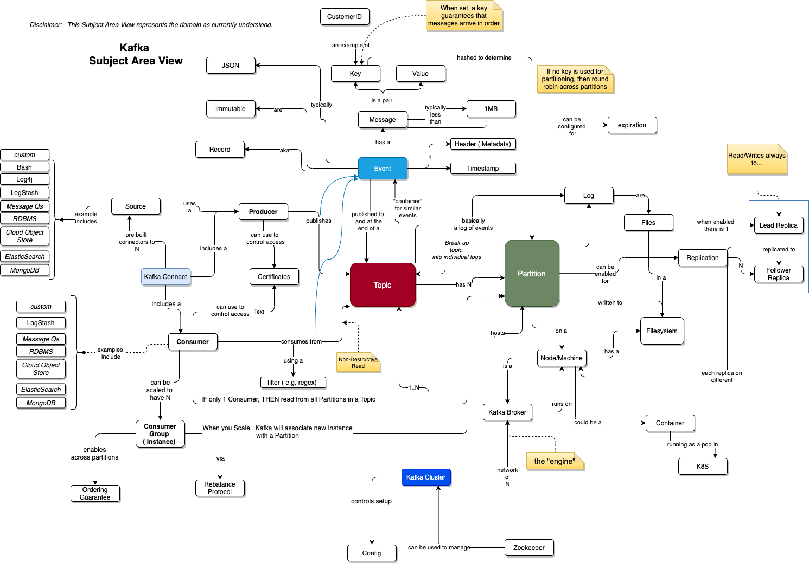

# Understanding Kafka and Event Driven approaches

## Some good supporting links

1. [https://ibm-cloud-architecture.github.io/refarch-eda/technology/kafka-overview/](https://ibm-cloud-architecture.github.io/refarch-eda/technology/kafka-overview/)
1.  [https://ibm-cloud-architecture.github.io/refarch-eda/technology/kafka-producers/](https://ibm-cloud-architecture.github.io/refarch-eda/technology/kafka-producers/)
1.  [https://ibm-cloud-architecture.github.io/refarch-eda/technology/kafka-consumers/](https://ibm-cloud-architecture.github.io/refarch-eda/technology/kafka-consumers/)
1.  [https://ibm-cloud-architecture.github.io/refarch-eda/technology/kafka-overview/advance/](https://ibm-cloud-architecture.github.io/refarch-eda/technology/kafka-overview/advance/)
1.  [https://www.ibm.com/cloud/architecture/architecture/practices/strategies-for-kafka-reliability/](https://www.ibm.com/cloud/architecture/architecture/practices/strategies-for-kafka-reliability/)
