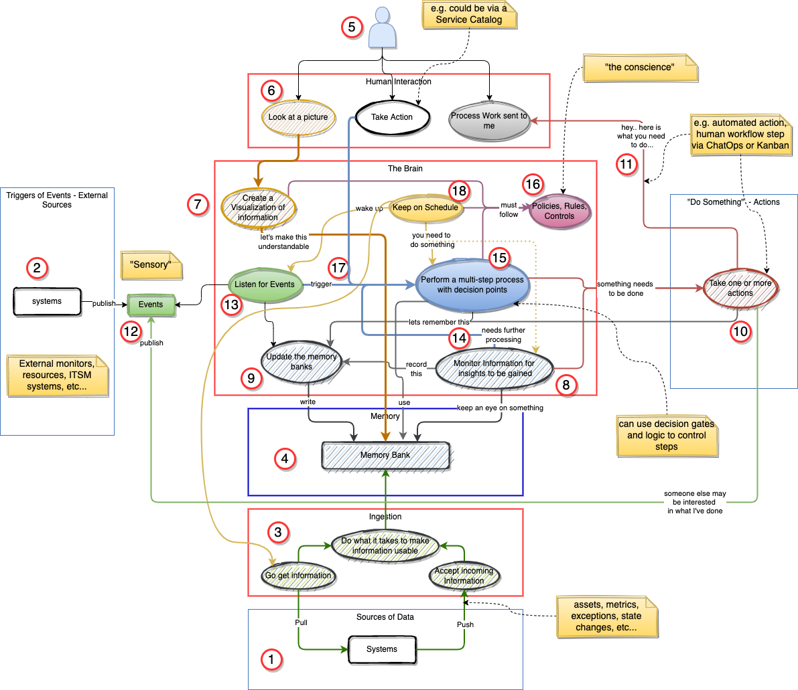

# A Perspective on the various aspects of an comprehensive analytical solution

## Purpose
Since this concept comes up in many different forms I felt it's important to document a perspective as a reference point. My focus here is purely conceptual to help illustrate a perspective.  

Think of it this way... IF you had to explain this to your Mother... how would you do it?

### Walkthrough  ( see the picture below )

1. At it’s core, the `Analytic Service` will operate on data coming from internal and external source systems AND
2. Events being generated in real time from external systems
    1. an Event is a message sent via a messaging or event management system.
3. The data coming from source systems is obtained via Ingestion processing that provides three services:
    1. Calling source systems and getting data from pre configured “endpoints” [Pull]
    2. Accepting data sent into Ingestion processing by the Source System [ Push ]
    3. Performing processing on the data to make it useable.  e.g. convert data, redact, etc….
4. The “Memory Bank” is the data store where all data utilized by the `Analytic Service` will reside.
    1. This is not necessarily on physical system. I could be a federation of “Memory Banks”.
5. The Users who both consume information and take action relative to the `Analytic Service`.  [ i.e. the Human Element ]
6. A key think people do is to see a picture ( aka visualization ) of data and the insights gained from the data…
7. To do this the `Analytic Service` needs to provide visualization services to make aspects of the data in the “Memory Bank” understandable by people with different roles, skills, etc…
8. Simply presenting information is not enough. There is a need to execute analytical logic against data to “mine” the learnings or Insights from the data.
    1. The goal here is to help people understand the data.
9. These Insights are themselves data/information that usually also needs to be stored in the “Memory Bank” for other uses.
10.  Having Insights alone doesn’t necessarily help people consuming the Insights.  What is needed is to have Actions to take relative to the Insights be either automatically processed AND/OR
11. sent to the right person so that they can take care of it.  In other words, give them to tools, information, and guidance to perform the actions required.
12.  The reality is that a data ( think database) centric view is not enough.  There is also a need to be able to “detect” ( aka listen for ) business and system events that are published from sources both internal and external to the organization.  These Events are structured Messages that my themselves be a summary event from other processing systems.
13.  This Listening service can do several things with incoming events: a) It can send them to the Memory Bank to be stored and the processed by the Analytical Jobs, b) It can trigger a process or action based on the event,  c) It could directly trigger an Analytical process to skip the latency of storing it in the memory bank.
14.  In terms of “Actionable Insights”, the reality is the actual Action to take could be more complicated than simply a “do X” action. Often, an Insight may require multi step processing where more analysis is required,  more systems need to be checked and correlated, policies and rules need to be checked, and people may need to be included as gating or control steps.
15. Thus, this is where the “Brain” leverages an orchestration element that performs a series of steps as part of an “Action”. AND….
16. checks with the “Conscience” to ensure that the policies, rules, business controls are followed…
17. Of course these sort of processes do not only have to be triggered by the “brain” alone.  They can also be trigged by people OR
18. by the “Clock” … ie based on a schedule.

