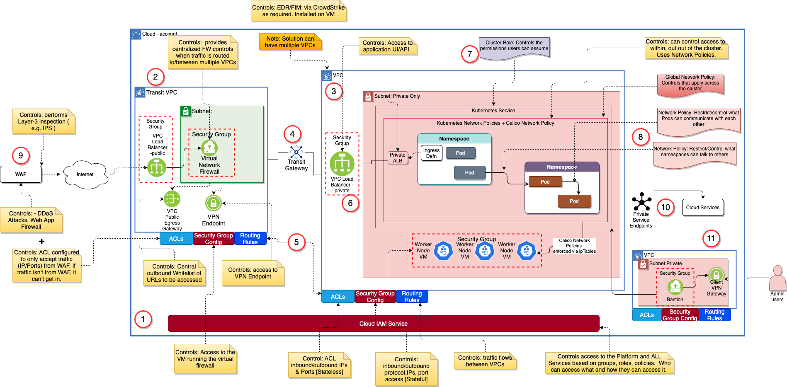

# Threat Model
Last Updated: {{ git_revision_date_localized }}

## Table of Contents:
- Purpose
- Key points
- Architectural Walkthrough

## Purpose:

A security threat model is a useful tool for not only understanding the security threats that are possible for a given solution, but also the architectural constructs that can be leveraged to counter the threats.  The purpose of this page is to walkthrough a threat model specifically focused on running a Kubernetes service on a cloud provider.  In this case, the Kubernetes cluster is deployed to a Virtual Private Cloud (VPC) based network.

## Key Points:
- The key to dealing with threats is to use multiple lines of defense for threats external and internal, with monitoring and auditing at each level.
    - This document focuses more on to control points than the monitor/audit points. That’s not to say one is more important than the other. The later will be covered in a later post.
- The architecture leveraged here has it’s foundation based on a set of key building blocks:
    - It is cloud based.  The same threat model can be applied to IBM Cloud, AWS, etc….
    - The network is based on Virtual Private Clouds ( VPCs )
        - There can be many VPCs hosting workloads in a solution architecture. The view below represents just one.
    - The concept of a Transit VPC is leveraged to provide a secure public entry/exit point for all traffic AND a consolidation point for network access rules.
        - Transit VPC Pattern:   https://aws.amazon.com/marketplace/solutions/infrastructure-software/transit-VPC
    - The use of Transit Gateway(s) to connect VPCs between accounts, regions, etc…
        - Of course VPC Peering can be used within a region/account
    - The use of Kubernetes and the Kubernetes network and the Container Network Interface (CNI) implementation ( e.g. Calico )
- A key element of control is also the Identity and Access Management (IAM) configuration
    - It is critical to controlling access to the elements of the VPC, the Kubernetes cluster, and the namespaces within the cluster:
- As mentioned above, there are multiple lines of defense.  In this case:
    - The Perimeter: This can be defended leveraging several technologies working in tandem: A Web App Firewall, a Transit VPC,  and or the firewall in the VPC. Alternative solutions could be be NSX in a VMWare solution, vSRX GW Appliance, FSA.
        - The Transit VPC and the Transit Gateway are key architectural elements enhancing the control and maintainability of this architecture
    - The virtual networks and associated controls within them. These include, but are not limited to….
        - The cloud provider VPC
            - VPC ACL: Control inbound and outbound traffic to your cluster by creating and applying access control lists (ACLs) to each subnet that your cluster is attached to.
            - The Route configuration of the VPC.
            - VPC Security Group: Control inbound and outbound traffic to your worker nodes by modifying a VPC security group.
            - ACLs and Security Groups:
        - The Kubernetes Network
            - Kubernetes Network Policy: You can use Kubernetes policies to control network traffic between pods in your cluster and to isolate app microservices from each other within a namespace or across namespaces.  When Kubernetes network policies are applied, they are automatically converted into Calico network policies. The Calico network plug-in in your cluster enforces these policies by setting up Linux Iptables rules on the worker nodes. Iptables rules serve as a firewall for the worker node to define the characteristics that the network traffic must meet to be forwarded to the targeted resource.  Kubernetes Network Policies are configured via yaml and kubectl.
            - Kubernetes Calico Network Policy:  Most Kubernetes distibutions use the Calico CNI, which is the kubernetes internal network that pods are connected to.  Calico supports standard Kubernetes Network Policy, but also provides its own custom resource definition which offers a lot of enhancements.  Install 'calicoctl' on your jump system and use it to manage Calico network policies.  Some documentation and education links below
- There are a number of best practices relative to VPC and Kubernetes deployment encompassed in this simplified threat model. See the Supporting Information Section for more details.

##  Walkthrough:

The following is a walkthrough of the various elements in the following picture:

1. Cloud Identity & Access Management (IAM) Controls:
    1. Role:  To control access to all services ( Compute, Storage, networking ) MUST be controlled via IAM.  Many of the threats from rogue internal users can be controlled via the capabilities of IAM.  It typically is also integrated with the Kubernetes Role Based Access Control (RBAC) mechanism to control access within K8S clusters.
        - Also included here can be the usage of Multi-Factor Authentication ( MFA )
        - https://w3.ibm.com/w3publisher/ibm-cloud-did-you-know/security/understanding-iam
2. Leverage Transit VPC pattern: All Public Access, inbound and outbound go through here.
    1. Role:  To provide a single control point for all traffic in/out of VPCs AND between VPCs.  In effect, a Transit VPC is a DMZ into a multi-zone environment.  This is accomplished via the use of an HA enabled, public facing, VPC Load Balancer;  a set of Virtual Network Firewalls (VNFs) ( for consistent FW rule mgmt); public egress gateway(s) to control/manage outbound traffic, and VPN Gateways.
    2. The key here is that the Transit VPC is the home for VNFs that provide a central point of control.
3. MicroSegmented Networks based on 1..N VPCs with all Subnets only exposed to cloud private network:
    1. Role:  The network design is the foundation to control the place meant of resources, and hence the controls.
        - By properly segmenting the number of VPCs leveraged and/or the subnets within a VPC using micro segmentation techniques coupled with VPC and Subnet level ACLs and Security groups,  access to key resources can be tightly controlled
4. Transit Gateway (TGW)
    1. Role: The TGW is an enabler to connect VPCs, in the same or different cloud accounts, via the cloud private network. TGWs can be leveraged as another vehicle to segment the network.  
        - Leveraging VPC Routing Rules traffic to/from TGWs can be tightly controlled if desired.
5. VPC controls:   To provide the “traffic cop” into, out of a VPC and to/from subnets and VMs running on the Subnets.  Increasingly finer grained access control.
    1. Access Control Lists - Role: control traffic to and from the subnets.  Controls IP addresses that can get into a VPC or Subnet (inbound access)  AND/OR IP addresses that can be targeted ( outbound)  [Stateless controls - Allow or Deny]
    2. Security Groups - Role:  Control Access to Virtual Servers.  In the case of a K8S deployment, they provide firewall level control to limit access to worker nodes.  For example, allow port 22 (SSH) access to VMs  [Stateful Controls - Explicit Allow]
    3. Routing Rules - Role:  Routing rules ( tables ) exist at the VPC to control traffic ( based on IP address ) that can ingress a VPC or egress a VPC.
6. VPC Load Balancers:
    1. Role:  To provide the control point (domain name/IP address ) to the services hosted in K8S.  By leveraging a “private” VPC Loadbalancer only traffic from the cloud private network can access the K8S cluster.
        - The usage of a Private ALB in IKS is dependent on your choice for routing traffic. See this https://w3.ibm.com/w3publisher/ibm-cloud-did-you-know/understanding-vpcs/accessing-apps-on-iks-via-vpc
        - The VPC Load balancers provide either Layer 4 or Layer 7 Load balancer.
7. Kubernetes Cluster Role Management:
    1. Role:  To provide access controls within the K8S cluster. Controls who has admin access and what they can access.   KEY POINT: in a hosted Kubernetes Service this can be configured and controlled via the cloud IAM.  Additional tuning could be performed leveraging the K8S capabilities but it must be managed in conjunction with cloud IAM.
8. Kubernetes Network Policies and Calico Network Policies
    1. Kubernetes Network Policies - Role:  Control access between namespaces, applications, and pods within a cluster.  This provides “east/west” control IF the previous lines of control are breached. Limits what an attacker can access.
        - 2 Levels of control:  1) Globally applied to the entire cluster. These rules enforce common standards across all applications. Enables standard controls. 2) Application/Namespace controls.  The Policies are defined to only apply to specific namespaces. Enables controls unique to an application.
    2. Calico Network Policies - Role: Builds on Kubernetes Network Policies to provide controls such as prioritizing the access rules, increase flexibility to match the controls (rules) to the environment and manage controls to VMs in one place.
9. Web Application Firewalls:
    1. Role:   Front line of defense for DDoS Control Point and monitoring of known attack vectors. The WAF monitors the incoming traffic and matches it against known attack types and points and blocks this type of traffic before it gets in.
10. Access to Cloud Services via private service endpoints:
    1. Role:  To ensure that the access to cloud services, consumed by an application workload ONLY utilize the private network and hence are not exposed to public internet threats
11. Bastion Host access to private subnet:
    1. Role:  An option control point to ensure that all operations access to an environment is via a separate network where tracking and controls are in place.  This bastion network is also only accessible via a client VPN.  

