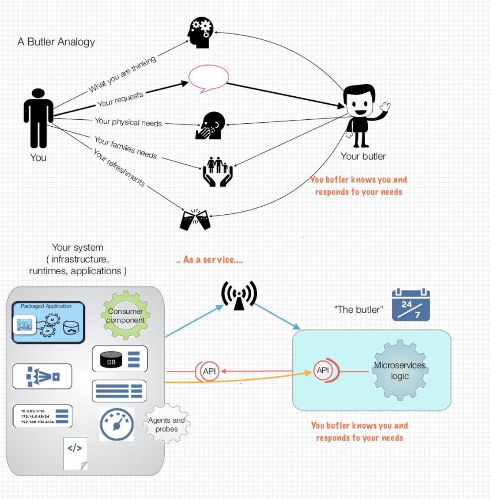
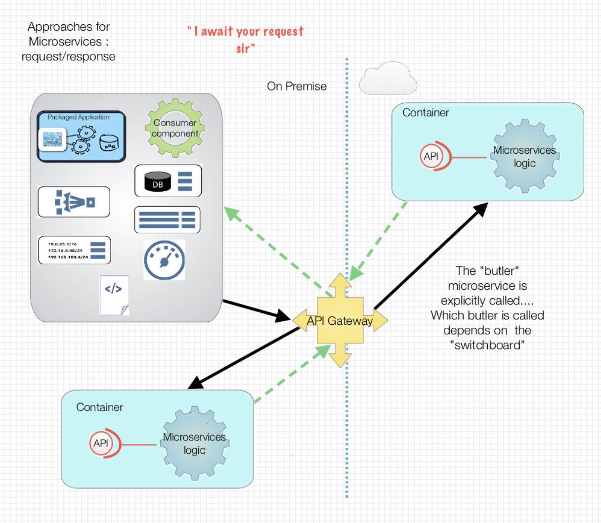
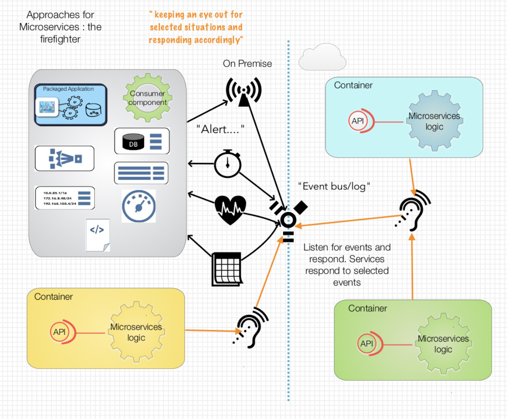
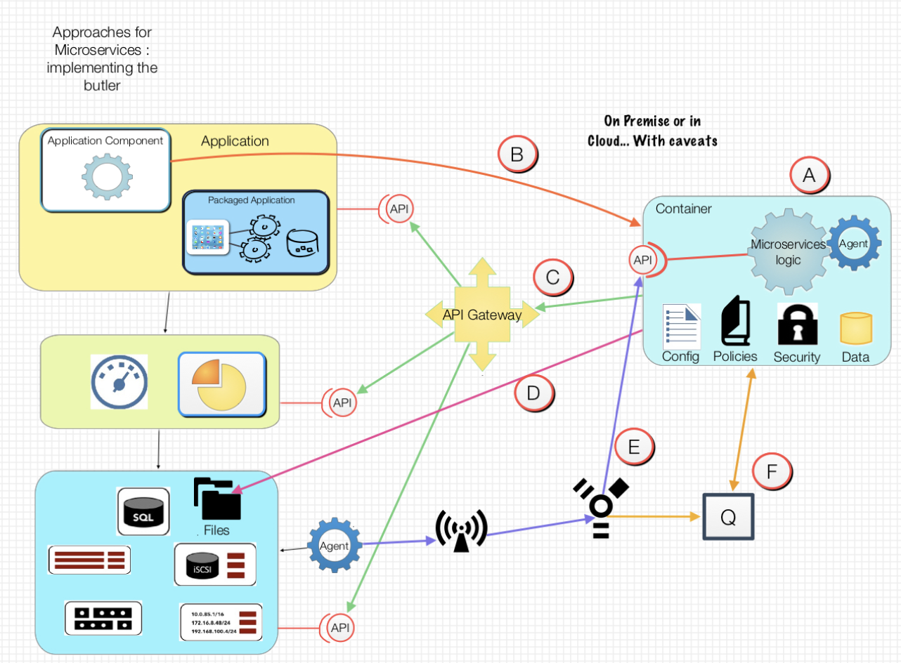

# “Alfred are you there?” :The Butler Microservice

__Original blog publish date: Aug 29, 2015__

Throughout this blog I’ve discussed what Microservices are, some history, the importance of data, and I’ve looked at a macro level of deployment and scaling. I want to focus more on an application architecture perspective for this post. One thought that crossed my mind in writing all of this is “so what?”. This is all really cool, but as an application architect ( one of the roles I’ve played) how does micro services affect or change how I could envision applications. If one adds in containers ( and Docker) into this how would that change it more?

I've done some reflection on this over the past summer month, among other things   and I thought I’d share my thoughts with you here.

## The problem: wouldn’t it be great if....

When looking at “as a service” models where the capabilities of systems are partitioned into microservices a couple of needs start to emerge. There is the need to have your traditional service that takes in requests process the request, and return some sort of response. However, wouldn’t it be great in a hybrid world where you could define a service that could also serve as that “butler” that followed you around and took care of key things for you? If you put your IT hat on think monitoring, configuration, cleanup, enforcing org standards, etc...

That pattern, all be it expanded much more, is one that I am seeing needed much more lately. Of course the later raises a number of questions:

1. how do you as a consumer communicate with your “butler service”?
1. How does it know about you and what you want, while still acting in a loose coupling manner? 
1. How does this “butler service” get to where you are?

I’m sure you are saying... Wow where the heck is he going with this. Perhaps if I frame out some capabilities of such a service it would help.

## Capabilities
1. Ability to be deployed both in the cloud and on premise... Including on mobile devices
    * Why: Well.. Because your stuff is running everywhere and the butler may need to be where you are. No this is not a hard and fast... It always have to be this way, but the bottom line is there is a case for a capability to deploy a butler microservice not only in the cloud, but also where your application may reside.
2. Ability to provide a services (API) for that can be called by a service consumer. Ok this isn’t any different that plain microservices
    * Why: yes this is a no brainier. A microservice should be a service provider that can be called by a service consumer. Yawn.
3. Ability to respond to events . Granted a different form of B.
    * Why: the movement to an Internet of things has highlight the need for an event based world. Applications in this model only let the world know when something needs attention. You know... You have kids right? Anyway, microservices need to be able to respond to and work in this world. It’s the old ” management by exception”
4. Ability to have a probe/monitor/agent to have access to and keep track of selected resources
    * Why: in this case the microservice not only sits there and waits for events, it also watches and/or probes ( sounds painful ) the systems, components, resources it’s watching and working with.
5. Ability to be configurable using programmatic config tools such as Chef, Puppet
    * Why: this is a key one... It’s not enough to always just deploy an instance of a microservice to the location it needs to go. You also need to configure it. Now with containers it may be easier to flip some switched and redeploy a microservice, but remember, containers ain’t the only answer. You may find you have a microservice that needs tweaking using recipes, API calls etc...
6. Ability for both the application logic and infrastructure configuration to be software defined.
    * Why: a microservice that serves as a butler for a a system may be responsible for being able to interact with both application code and infrastructure . The former assumes that the microservice has the capability to gather information about the app ( I.e. Read files or data bases... For example) while the later assumes that some sort of software defined environment is in place ( think cloud provider)
7. Ability to log everything done with management, e.g. ” butlers R us” corporate headquarters.
    * Why: because at the end of the day.... we aren’t alone. There is always a need to work as a team.

## Options and approaches. What, why, how

As I’ve done in my other posts I’ve tried to use pictures to simply my points and I’ll do that again here to layout the different ways a butler service could be implemented.

### “At your request”.... Traditional request/response service

In this mode the microservice is there waiting for you to call its APIs. Shocking huh? Yes nothing really new or different here. But it is a foundational approach that can be utilized to implement a butler service.

### The firefighter... Service responding to events...

In this case the “at your request” microservice is combined with an event management and routing infrastructure ( perhaps a Kafka/Storm combination) to take care of the heavy lifting of those capabilities and simply call a microservice as an action. Of course, for special cases the infrastructure ( think container) being used for a microservice can also be setup to contain its on little ” fire call routing service”. That would make it even more reusable.

### The butler service... Working where you work

Finally, at least for this post, let’s look at the butler service that could be:

* Deployed either on premise or in the cloud
* Can serve in both a proactive and firefighting mode
* Knows about you and what you like given processing of analytics and/or policies 
* Has access to information about your current situation

What would/could that look like?

* A) a container that provides some service running in an environment that provides the foundational services required to operate, I.e. Logging, monitoring, etc... ( more about this in a future post)
* B) this represents direct request/response connection. Yes it does couple these 2 together since the consumer needs to know about the provider.
* C) in this scenario the butler service needs to communicate with the master. I have it here going through an API gateway to avoid the problem from B. Obviously, there are drawbacks to this, but it is one way that the butler could interact with the master.
* D) so this is an interesting one. The butler could, repeat could, be setup to access a file(s) that are local to the master. In this way the butler could monitor say a local log file.
* E) in this case the butler Apis are not triggered by the end consumer but by an event mechanism that maps a specific event to a microservice API. Now this assumes that some sort of registry is in place to know about the microservice APIs.
* F) finally, the tried and true message queuing approach to integration. Don’t knock it. Its key to async integration that has a core place in loosely coupled systems.

## Wrap up
Hopefully I’ve provided a perspective as to how microservices can be utilized in traditional and non traditional ways in this post. With a little creativity, it is possible to create your own butler services, but understanding which approach is right for you is the place to start.
