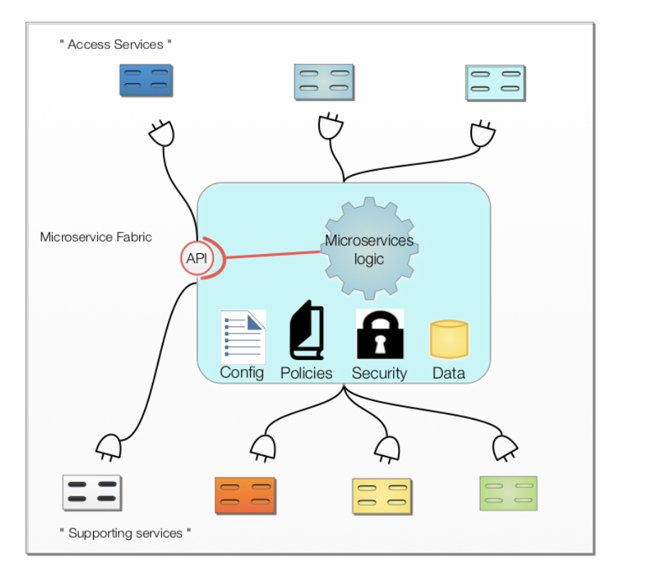

# Implementing Microservices: Do you want to become “ConEd”?

__Original blog publish date: Nov 7, 2015__

Well, it’s amazing how the day job can impact ones blogging. As you may notice there has been a gap since my last post. Alas, time is one of those precious commodities in life Ok, enough philosophy. When we last left our intrepid microservice we were discussing what that service would need in order to operate. I called that the “utility infrastructure”, for lack of a really cool buzzword. Now it’s time to examine the how. How these utilities are delivered and how micro services could be deployed to utilize them.

Now, during the last couple of weeks I did spend some time “sharpening the saw” so to speak, searching the web for supporting material. One thing I found is that there are a fair number of resources that explain the steps to setup and deploy microservices in the form of containers, PaaS apps, etc.. 

You know these articles: Step 1: type in this URL... Step 2: click button X. Don’t get me wrong these are all needed, but it is very easy to loose context as to what you are actually doing. You know.. the big picture. I’ve tried to focus on the big picture and context view in this blog so as I get into the how, I’m not going to get into this detail mode.

Ok... back to the topic at hand. In this post I am going to look at two things:

1. How the utility infrastructure can be delivered.
2. How microservices can utilize that utility infrastructure.

From a visual standpoint, I’m going to look at how a Microservice connects to the “utility services”. These utility services are the cloud platform that really enable the designer/developer to get the job done. Personally, I classify these as as “Access Services” and “Supporting Services”. Access Services are those that help control access to the Microservice, help others find the APIs of the micro service , etc... . Supporting Services provide utilities such as caching, logging, policy management, workflow control, persistence, configuration management, etc... .

For those of you that of followed my previous blog posts you will notice I like to draw pictures. The above picture is helps to provide a visual into this concept. Think of the Microservice has the thing that plugs into the wall socket. The sockets are the enabling services of the platform ( think electric grid) you are going to leverage.

## Key Points regarding Microservices that bear repeating

__Keep it simple as possible:__ First off, and I am very guilty of this... let’s not go overboard on this. Keep your microservice light. ( I’ve probably blown this tenant with the sketch I drew above. See I’m guilty of it.) Ask yourself, do you really need to utilize a utility function within your microservice or can this be delighted to the consumer. For example do you need to log all interactions or can you simply provide the call with what is needed for them to do this? Do you really need to maintain a persistence store?

__Event Enabled:__ Keep in mind you may want to strongly consider, as a key utility service, an event management infrastructure or queuing system. That way you can simply ship information to that service and let it take care of the details. It helps you to minimize the number of utilities you are dependent on. Think the “post office”.

## How the Utility Infrastructure is Delivered
Back to the “Utility Infrastructure”. Ok, stupid name. I’m going to call it the “Cloud Platform” because that’s what it is. A comprehensive set of services provided to designers and developers to craft the solutions required. These utility services come in several forms. You can think of them as different “access points in you home”. Think about it: you have electric power plugs, phone jacks ( remember those ?) , speaker ports, plumbing faucets, wireless hotspots, Mobile/cell access, etc... . Each of these provide access to specific services.

The same holds true for microservices. If you put yourself in the place of a microservice you may find that you need these services, but you really don’t care how they are implemented. You just want access to them.

The difference here is that when looking at a Cloud Platform, the services may range from IaaS services ( getVirtualServer, createNetwork) to deployContainer, to createCache, to validateSecurityProfile. I think you get the picture. In essence the utility provides services to:

* help test, validate, deploy a microservice
* configuration, management, and monitor micro services
* keep the environment up date, track SLAs
* store information, transform data... the “Supporting Services”
* create the specific compute, storage, network infrastructure your running on.

Again... like in your home, you really don’t care about how these are enabled or where they running... for the most part, but just that they are there when you need them.

Notice something here? The concept of IaaS, PaaS, SaaS is blurring. Where historically we liked to keep these all nicely separated, that is getting harder to do. It’s time to get past that and just think of all of these as a Cloud Platform. Just look at your favorite cloud provider. Do the services the organize the services they offer into these layers? No... they are moving from that quickly.

Now back to the question of how these services are delivered. Let’s build on our analogy from before, some of the options include:

1. like your home or apartment, you can tap into the local utility grid ( network, power, phone, water/sewer) and leverage these via APIs.
2. you can go “native” and setup your own, where possible. Install solar and wind so you don’t need the power company. In this case you would package the runtime logic/libraries in your package/container to perform the task needed.

Each has their implications. In regards to number 1. It’s all going to depend on the quality of service provided. Are you ready to support this? What if you want to move? The challenge here is that there aren’t necessarily standards for all utility service APIs. Hence, if you want to move you may find that you have to reconfigure or rebuild your connections. But hey... you are traveling light. Just keep in mind.. not all hotels ( re “Cloud Platforms” are 5 star hotels. Don’t get caught in the “Bates Motel”)

At the other end of the spectrum, you have more options. Just like building your own house. You have the ability to define how the services are deployed, but you also have to create or setup the utility infrastructure for these. Do you want to include all utility support in your Docker container? Just how “native” do you want to go? Is there a level of “shared tenancy” you can support?

What’s my bottom line for this post: If you want to leverage a the services on a Cloud Platform, that’s cool, and it’s pretty easy. You just need to reference the service provider in your code ( e.g. Environment variables, Include/require statements, or via the tools providers offer) and off you go. Given the pre-built starter kits ( think “model homes”) that are available today it is become easier by the day to do this.

Still want to go native? Well given the advancements in containers today that too is becoming easier too. But remember, just like moving from an apartment to a home, you will have do deal with problems you could defer to the “super” before. Are you ready for that?