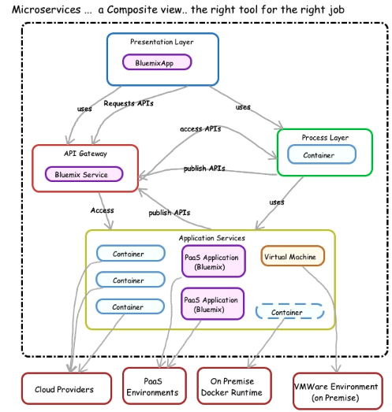

# Containers are the answer right? What was the question?

__Original blog publish date: May 31, 2015__

So the answer is to implementing microservices is containers right? All containers, all the time, right? Well, you may think that if youhave seen my earlier posts. However, as an IT Architect one always has to caveat it with “it depends” or “ what about?”.

In this post I’d like to explore this topic deeper. I’ll overview some of the capabilities required of a runtime to enable a microservices “domain” and explore some options. Before going on, let’s look at what I mean by ” runtime”. In this context, I am referring to the engine and services needed to run application code. One could say, well that’s just a server + OS + middleware. Well, yes, but one needs to put a slightly different lense on it when we look at microservices.

What capabilities are generally needed for a runtime for a micro service? This is not an all inclusive list, but here are the top 5:

1. enable loose coupling: ability to be independently deployable, updated, with managed dependencies
2. scalable: ability for multiple instances of the same microservice to be quickly deployed to support transaction/request loads 
3. composable: ability for the runtime to support multiple “building blocks” that can be preconfigured to work together and to be deployed together
4. manageable: ability to be managed and monitored by existing service management solutions
5. automated: ability for the definition of the runtime and application code that runs on it to be “coded” in a manner that enables the other 4

While there are obviously more, I believe these are the top 5. Again, I’ve created this focused on what the runtime needs to support, not the application.

Lets look at some options for the runtime for microservices.

## Containers: ( with specific focus on Docker)
You knew this was coming. It is the cool new thing. ( actually it’s not that new. It has been around in various forms for decades) Docker and it’s support for containers provides a very nice runtime for microservice logic. Why? Well, let’s take a look at a few: 

1. the contents and configuration of a microservice runtime can be documented in a human readable file that can be managed and versioned as code.
2. Docker containers can be stood up quickly, on demand, to take loads. They can also be stopped quickly.
3. Docker containers align nicely with the atomic, loose coupling of microservices architectures.
4. they can be linked, deployed in groups/stacks, and orchestrated from templates such as OpenStack Heat.
5. they are generally portable to providers that offer Docker container engines.
6. they have the ability to access files/storage outside of the container, thus the applications can be modified very quickly that is running on them. ( note that’s only one way to do it   )
7. the container image can be stored an a repository for sharing, simple access, and startup.

So the bottom line is that the use of Containers does open up some new options for deployment of microservices.

Some key things to watch for include :

* whose running the container environment?
* who sets this up?
* are you trying to spawn multiple threads ?
* whose handling restarts or adding more instances ?

## PaaS Runtimes: e.g. Bluemix, Heroku, AWS Beanstalk
Ok, like I mentioned, there are multiple ways to do this. Another option, that can be used is to leverage a PaaS runtime.

You may find that for a specific microservice domain, it does make sense to build it out leveraging available runtimes on a PaaS environment, such as IBM Bluemix. Since I am most familiar with that , I’ll use that as a reference.

Remember, at the end of the day a microservice is a freestanding application that provides specific services to a consumer. The consumer could use those services individually or as part of a broader solution.

Here’s how I see a microservice being implemented on a PaaS.

* setup an account on Bluemix
* use the create an application interface to choose the runtime of you choice ( e.g. Java, ruby, nodejs, etc...) , and add the services you require for that microservice. These can include services such as identity management, log management, relational or NoSql storage, analytics, monitoring, etc...
* this will create your personalized runtime on Bluemix and optionally connection up to the DevOps interface so that you can directly import or create your application code that defines what you microservice is and how it works. Again, the key is your microservice uses the runtime and supporting services you selected in the previous step.
* remember, it’s your code that you create the defines the microservice apps that consumers would use.
In the end, what you have is a running microservice, that you can scale ( add memory or more instances) using the capabilities of the PaaS.
Some key things to keep in mind:
* scripting the setup, config and deployment of an applicant on a PaaS such as BlueMix is possible, but it is can be unique across PaaS environments.
* if you use services provided by the PaaS environment, there is a risk that portability across PaaS environments will be limited. E.g if you use an identity management service on Bluemix it could be a challenge to move AWS. This is not a universal statement, but a warning.
* if you want to group applications together and deploy as a unit to a PaaS it is possible using an automation tool/language such as Chef or BOSH. It does require a specific set of recipes/scripts to be used. If you want to use Openstack Heat templates to orchestrate applications ( I.e. microservices) to a PaaS and containers, well hang in there. Anything is possible with enough work, but it isn’t easy yet.

It is important to note that the PaaS is responsible for making sure the environment your runtime is operating in is in fact running and able to support you needs. You simply need to manage the application , I.e. the microservice.

## Virtual Machines:
Finally, at least for this blog post, good old virtual machines can be utilized.

You can create pre-built virtual machines with the proper runtimes and then save those images in an image repository. Tools such as Chef and OpenStack Heat can be used to launch instances of those images and then the latest application can be deployed to them.

So in essence, the top 5 capabilities can be supported. However, with virtual machines it’s the size of the unit your working with that can cause issues. Remember virtual machines include the OS and you need a hypervisor to run on. Hence, someone is going to need to keep those systems patched/ updated. True, this also exists for containers, but just something to consider.

The value here is that given the technologies discussed above, one can include virtual machines in you microservices solution architecture. It does allow you to consider reusing existing applications or assets and making them available as a microservice. I dig deeper into how that could be done later.

As you will note in this post I’m not making a specific recommendation.

Thats because its not a one size fits all when it comes to shaping a microservices architecture. You could frame a solution that leverages one or all options I’ve listed here. Which one(s) you choose depends on where you are in the journey, what you are comfortable with, and where you are going.

To summarize I’d like to highlight some key points:

1. microservice application code needs to be packaged and deployed in some manner, these provide the enabler the same code could be deployed in multiple approaches
1. overall, a solution could leverage one or all 3 approaches
1. overall solution would more than likely be a collection of many “containers”
1. the overall solution ( collection of micro services ) could be deployed to multiple providers ( e.g. clouds) on premise or off premise ... i.e. Hybrid