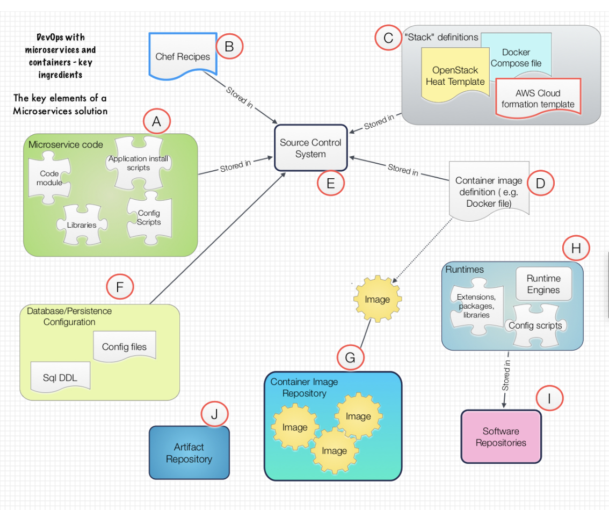
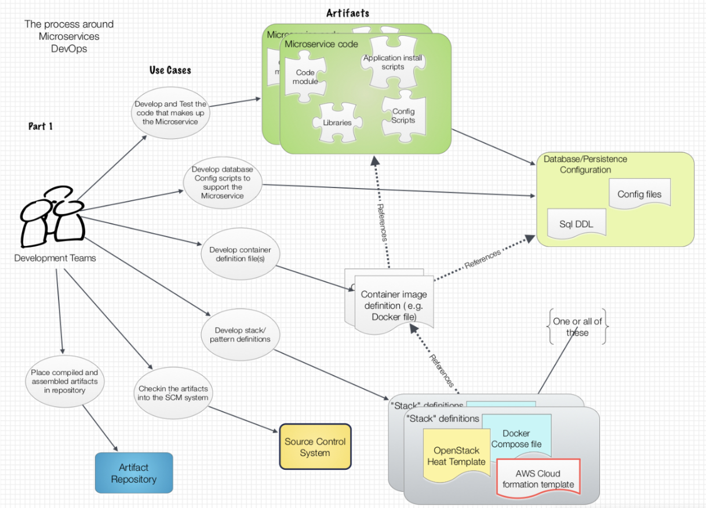
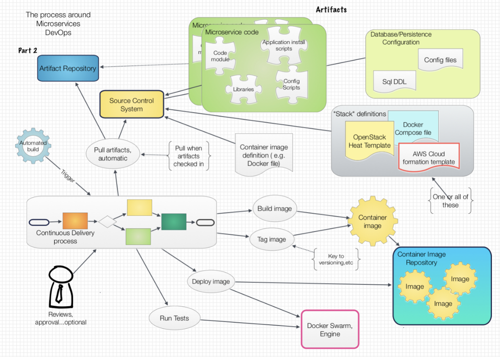
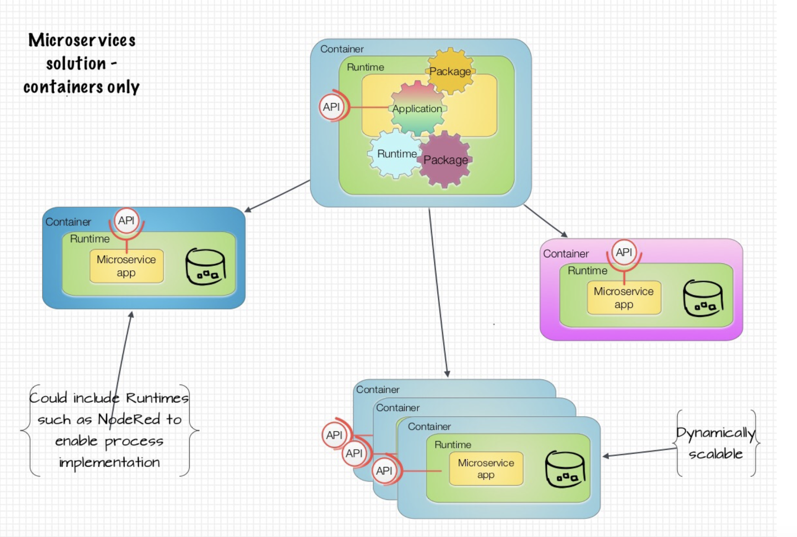
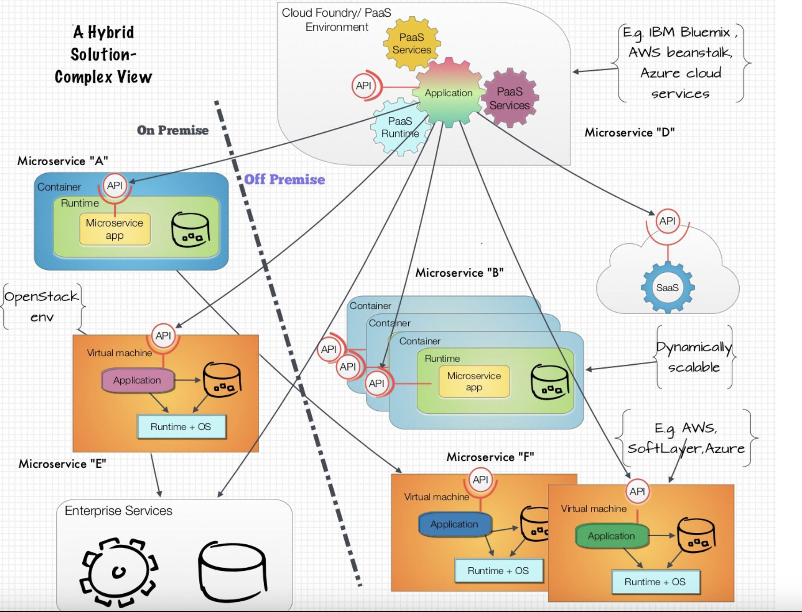

# Continuous Delivery with Microservices

__Original blog publish date: Aug 7, 2015__

How can DevOps principles and approaches be applied to microservices? I’m struggling to help visualize what this looks like and how it works, can someone help me?

In an earlier post I reviewed how a system of microservices could actually be deployed using various technologies. Namely, container based apps, cloud foundry applications ( e.g. Bluemix) , and virtual machine based services. In this post I’d like to dig deeper into the continuous delivery (CD) process to make this happen. Specifically, what are the major pieces that come into play and what are some key considerations. I’m not going to be able to go into all of the nuances and key areas such as networking and storage in this post, nor do I claim to have it all sorted out yet. However, my goal here is to start the discussion in regards to what does it take to structure and deploy a system of microservices leveraging a continuous delivery process.

## Things I’ll focus on:
First off, let me highlight what I’ll focus on in this post. When you are done reading this you should have a better understanding on these topics. Or at least you will see my perspective

* What are the ingredients of a solution that are constructed in a continuous delivery/DevOps environment?
* A review of the basic process
* What does a microservices solution, leveraging only containers, look like when you combine the various elements? How about a more complex Microservices solution? Leveraging multiple technologies.

## Key points
Before beginning, there are some key points I’d like to highlight.

1. At the end of the day, everything related to microservices is code, hence it can be treated the same way
2. Applying Continuous Delivery ( CD) techniques to microservices doesn’t require a new set of tools . The CD tools and
processes that apply to non-microservices apps also apply here. True, there may be some additional steps, or some removed,
but the overall flow is consistent.
3. You still have to keep dependencies in mind. If you are doing CD work on a Microservice you do need to be cognizant of
services it may call or who may call it. There may be Apis that need to be registered in an API Gateway before starting up a service.

## Review of Ingredients

In order to really understand how something works, I have found its important to understand the pieces and how they fit together. Below is what some call a simple “subject area model”. The view highlights the major elements of a typical microservices solution that
is designed to be deployed onto containers.

## Itemized view of the elements
* A. In order for for a microservices solution to exist, there needs to be code that implements a microservice. This code can be developed using multiple languages. Some are interpreted, some are compiled. In addition to the for code, there is often the use of configuration scripts, install scripts, and supporting packages and libraries.
* B. A specific type of install and configuration scripts are Chef (or Puppet) recipes. I’m calling this out as a stand out element here because of the importance this plays in the market today . These are not required for this sort of solution, but they generally are part of a solution like this.
* C. Because more complex microservices solutions can consist of multiple containers working together, There is generally a need for some sort of configuration file to codify what containers go together and how they go together. I’ve listed a couple of approaches, not all of which are container specific . In the cast of container only solutions, a Docker Compose approach would be a good solution.
* D. Complementing C, and frankly a predecessor to C, in a Docker Container solution, is the docker file that details out what each container image is based on, includes, and how it is built.
* E. As I mentioned earlier, each of these elements represents code. Thus, there is a critical need for a source code management system ( e.g. Git ) to manage versions of the code and configuration files.
* F. One element that sometimes if overlooked, or not talked about a lot, is the database configuration information. For microservices that provide persistence support, or even caching, there is usually a need for information ranging from Simple configuration info to DDL.
* G. When you have containers, you need a repository to hold the built containers. This can be docker hub, but more than likely for enterprise systems it’s a private repository.
* H. When building containers the core software run times are an element of the solution since the docker file will detail which run times are included in the container image. Often times these runtime, if open source, are pulled directly from the Internet, though they can be pulled from a local repository.
* I. The software repository is the “where” the previous elements are pulled from. Examples include apt-get or .YUM repositories for
I. The software repository is the “where” the previous elements are pulled from. Examples include apt-get or .YUM repositories for Linux.
* J. Finally, while I discussed the fact that the source code is often placed In an SCM, compiled elements, or artifacts, are often placed in an Artifact Repository. This is important as it is a source of assets used in the continuous build process below.

## The Process
Now that we have looked at the structure let’s take a look at the how a continuous delivery process utilizes these elements. Again, the focus here is on Microservices and Containers. Anything beyond that and I’d be writing a book.

First I’ll provide an overview from a developers perspective and then we will look at it once the code is checked in; I.e build and deploy. Since I’m a believer in the motto “a picture is worth a thousand words” I’ll try to avoid a simply repeating what is on the picture

If you are or have ever been a developer this first picture probably holds true. At the end of the day there is always code, always a source control/versioning system. The key points here are that in addition to storing the app (Microservices) code in the SCM, we are also storing the container and pattern configuration files in the SCM. It’s the collection of these that make up the end solution. Note that this same general process applies to a very simple, atomic, Microservices, to a larger grained Microservices that aligns more to a domain; e.g. Order Management.

One specific item to highlight. You notice I have both an SCM and an artifact repository. I did this because while many languages today are interpreted, there are also many that are compiled and thus there needs to be a location for the build. Think .exe, .jar, .war....

The second view focuses on what happens once the code has been checked in. In a CD world the build and deploy processes generally kick off as soon as the code is checked in. Again, the key differentiator and value add when using containers is that not only is the code being built and deployed but so is the infrastructure configuration ( compute, storage, networking ). Using tools such as Docker or Mesos we now have the ability to have a continuous delivery process deploy into a hybrid environment very simply.

## Solution Views
Finally, to complement the discussion above on continuous delivery I thought I’d share two views of Microservices solutions. Why?
We it helps to provide some context for what would flow though a CD process. And it sets up some future posts nicely
The first is a “simple” Microservices solution that is made up of a collection of Microservices, deployed in individual containers, that work together.

A few key points here:

1. The components are loosely couple via APIs ( I’m not showing the API Mgr etc... as I’ve referenced in my other posts. 
1. Each could be developed with different technology.
1. Each could flow through the CD process independently.. but be careful!
1. select services could be deployed via clustering engines such as Kubernetes to achieve required scale

The second is a more complex, hybrid solution, that reflects the use of multiple technologies deployed on and off premise. So what you
say? Well, to be honest I’m including this because 1) it was fun to draw and 2) because it highlights why getting organized around a CD process is so key. Note that each of the Microservices referenced I this picture can be deployed individually or as a unit. That’s where technologies such as Compose, Heat etc... Come into play. I’ll get into that more later.

## The bottom line

Ok... So where does that leave us. My goal here was to start a thread on how DevOps and Continuous delivery relate to Microservices. As you can see in general this is just another ” turn of the crank” related to the same thing hopefully many of us are already doing. It is important, I believe to understand the context of how the pieces fit together though. Thanks for reading along!
