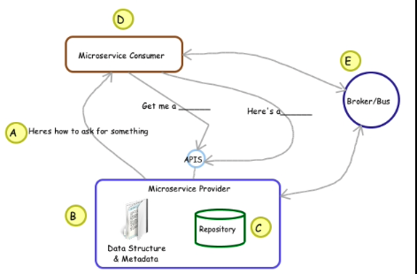
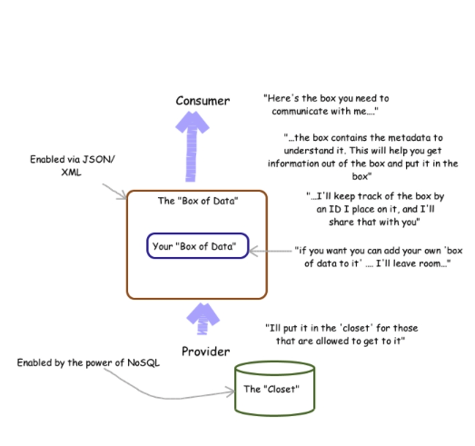

# Don't Forget the Data!

__Original blog publish date: June 14, 2015__

If you have been following along with this blog you know we have covered where microservices can run (e.g. containers) and how they could be connected ( node-red) . Now let’s discuss the data. For those of you that read my old paper you will recall that the topic of data was a key focus in the past. It still is. When we think of Internet of Things , think massive amounts of data.

## Rewind

Since this blog title includes the word “yesterday” I thought it would be interesting to look back at some excepts from my paper of 14 years ago.

* Object Identification & Understanding: In other words, how do we uniquely identify business entities between Web Services and how do we understand the meaning of the data?
* Referential Integrity: How to we keep the data, maintained by Web Services in sync and accurate?
* Reporting across components: If data is spread across multiple services, how do we get a consolidated view?

1. If a business process requires data that is maintained outside it’s domain, can you simply pass the process an identifier to this data or do you need to pass in a representation of the entity (i.e. the whole object).? From a strict “loose coupling” standpoint the component should not have logic as to how to get such an object.
2. If a business component is responsible for maintaining data that has a relationship to data outside it’s domain, how should it store this relationship? For example. If an order management component needs to store customer information related to an order how does it do this? Is storing the identifier enough? Does it also need to store meta data about the source?
3. If a business component stores identifiers or data that is owned by another domain (see above) and that data is changed or removed by the owning component, how does the consuming component know about the change? How is referential integrity handled? For example: if an order maintains an id for the customer that ordered that and the customer is deleted, how does the order know about that? Does it need to care? What if the order holds a copy of the customers address and that changes? Does it care?
4. If a component is designed to receive data from another component or “domain” how should it represent that data within it’s domain? Does it need to define/create it’s own object structure to hold this data? If it attempts to create an object to hold the data, that was defined in the other component, then there is coupling on 2 fronts. If it doesn’t put the data retrieved into some sort of container that gives meaning to the data how does in know which attribute is which?

Yes... a lot of questions and no answers. Gee thanks.

A lot has changed in 14 years, but I believe these questions are still valid. We now have some additional tools and approaches that can be employed to address some of the challenges.

## Setting the stage
As we have discussed previously, a typical Microservices architecture can include some of the following characteristics:

* Independent components: They can be build deployed, upgraded, managed on their own.
* Each can manage data independently using it’s own database/repository or
* The Microservice could leverage a data service that could serve as a store for multiple Microservices. ( there are challenges with this approach)
* Each Microservice should be focused on supporting a specific set of data. Not boiling the ocean and trying to store everything 
* And finally, I’ve always discovered that, when it comes to data, each Microservice needs to generally support your basic CRUD operations. Create, Retrieve, Update, Delete. Now these services can be exposed in more business terms ( i.e. CreateOrder, RetrieveCustomer) but at the end of the day that’s what they do. In addition... yes there is more... don’t forget that support is generally needed for working with a list. Specifically, getting a list of “things”. For example: GetOrderList.

For reference, this problem space was eluded to in the picture I attached to the preview post.

## Let’s dig deeper

Now that I’ve set the stage, and probably put you to sleep, lets dig deeper into 3 of the challenges I’ve discussed above. 

1) passing data to a Microservice ( by reference vs by value )

This topic is not only related to the data topic, but also performance. At an individual level it may seem easy enough to simply pass a complete JSON or XML message to an API of a Microservice (i.e. pass by value ) but remember, as these things scale up that could get into a lot of traffic on the network. One thing I learned over the years working with distributed systems is to keep the communication light. Don’t send “fat” messages if you don’t need to.

2) associating data across Microservices

OK.. so you want to keep the communication light weight. What if you are the Order Processing Microservice and you need information on the customer. You could pass in a JSON message with required customer information along with the order. Won’t that make the request even “Fatter”? Why not just pass a customer ID?

That’s just referential integrity in an RDBMS right? Sorry.. remember.. we are trying to ensure loose coupling. This is more of an Object Oriented DB discussion ( blast from the past) than a traditional relational discussion. Sorry, Mark. (Mark was a super Oracle data architect I dealt with where we had many a lively discussion over this in the past)
         
3) understanding the data

Which leads us to the last item... how to understand the data? In the general paradigm of a Microservice we have a consumer and a provider. If the provider is responsible for managing information it will also need to understand it. How does it pass this on to the consumer?

OK... so what can we do about this?

There are a number of ways to think about how to attack this but I’d like to share ways to look at this that may help think through some options. The first is to look at it from a contract perspective and in the second I’ll use a box and warehouse analogy. I’m going to have to cover more of the details in followup posts as this one just past 1000 words and I bet you are getting bored.

As you review this pictures and the messages included within them remember... the goal here is to have independent, loosely coupled, stateless ( where possible) service providers ( Microservices) in which the consumer is able to understand how to communicate with them programatically.

## The Contract:

A: First and foremost, at the end of the day it’s a contract between a provider and a supplier. The contract (API definition) needs to provide not only the endpoint to call but also the data definitions so that the consumer can know how to interact with the provider.

B: The provider needs to define what data it requires and shares and how to understand that data (i.e. the metadata). Note that using the latest technologies such as JSON and NoSQL, it is easier to insert consumer specific information without schema changes etc. See the next item.

C: The provider is then responsible for storing this information.

D: A key point here is that in this model, the consumer does need to “read the contract” and put the data in the required format. This may/generally requires transformation of message structures. But again.... that’s not really new or surprising if you are trying to promote loose coupling. Speaking of that...

E: If you really want loose coupling a broker or bus needs to be introduced to perform this transformation.

## The Box:
A way to think about what is passed and how it’s passed.

As I said, there is more to cover here, hence the value of a blog, but I’ll leave it at that for now. I’ll pick this up again in a future post.
