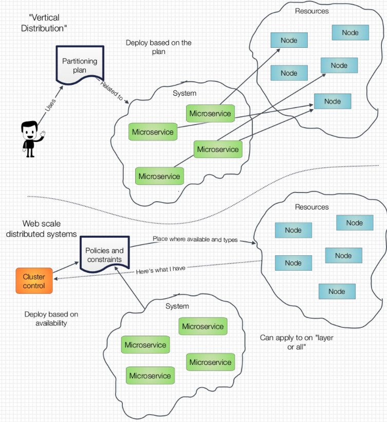

# Distribution of Microservices: different strokes for different folks

__Original blog publish date: July 6, 2015__

One thing experience teaches you is that terminology is key. Words and phrases can have many different meanings. Let’s take one: distributed systems. This is a key aspect of a microservices architecture. If you have watched any YouTube videos or read any material on this topic, or the enabling technology around it you will note that one value of microservices is that it enables one to quick build/assemble distributed systems.

But just what is a distributed system? Different interpretation of the phrase Distributed System can lead you down very different implementation choices. Over the years I have seen it described different ways. Let’s start with one of the ways Webster’s defines “distributed”.

2 : of, relating to, or being a computer network in which at least some of the processing is done by the individual workstations and information is shared by and often stored at the workstations

Let’s look at some interpretations of this:

## “Vertical Distribution”
In this scenario, one can view taking a “system” and breaking it up into smaller pieces. Certain elements or even whole layers of the system can then be placed on different nodes in the available environment. This partitioning of the pieces, or distributing, the microservices out to different nodes allows designers to make conscious choices about how to perform distribution.the most classic of this was the old fashioned “client/server” system, but it goes much deeper than that.

If you have been reading this blog you will notice that a fair portion of my original paper was aligned with this perspective and interpretation.

## “Web scale distribution”
Another way one can look at distributed systems is centered more on how “web scale”, or ” born on the cloud” systems, are designed. When one looks at distribution of these systems, it often focused more on distributing out a layer of the solution. For example designing a solution to be able to handle large and “bursty” workloads. In this scenario, enabling infrastructure is leveraged to remove the need for a designer to make explicit and complex choices about what component or microservices of the application goes where. The infrastructure simply takes the microservices and the defined policies plus constraints, finds available capacity and sets it up. In a way, it becomes the “broker” for where to put functionality.

The enablers, that include cloud autoscaling ( AWS, SoftLayer, etc... ) and capabilities such as Kubernettes or Apache Mesos, utilize a policy based approach to implementing then dynamic distribution of system components.
Often what is distributed here is not all the components of a system. Rather on layer, domain, or... Microservice.

## Why is this important?
Well, first if someone asks you for a “distributed system” it helps to know which type you are talking about. Much of the innovative work happening today around driving to microservices involves heavy focus on the later. This is where you find the LinkedIn’s, the Twitter’s, and other born on the cloud systems innovating to help them scale. As an offshoot, this is where work such as Kubernetes comes from.

It is important to understand what these technologies are aimed at addressing, how they work, and why they are applicable to you microservices architecture... Or not.

## Can’t you have both?
Well, yes . One can easily envision a system, or application, architecture that leverages microservices that may require both forms of distribution. Certain layers , or services may require the dynamic, web scale distribution that are capacity driven. Other microservices may have requirements, or constraints, that require it to be provisioned to certain locations or types of resources. In other words, more of the “Deliberate Partitioning” approach defined above.

In upcoming posts I’ll examine more of the “how’s” and “whys” that this could be done.
