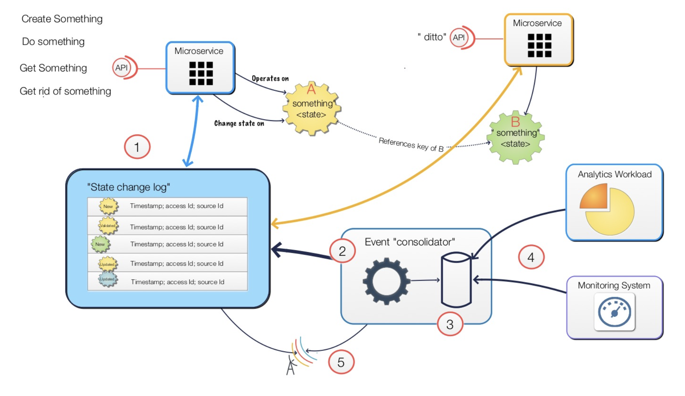

# Event logs, State Flows, Microservices.... How do these relate?

__Original blog publish date: JANUARY 6, 2016__

If you have been following this blog you will recall on of my earlier posts that highlighted the challenges of data management in a microservices environment. 

That earlier post was based on my experiences in trying to implement a componentized, loosely coupled architecture on a project many years ago. On this project we had a team member who, at the time, was adamant that implementing a state machine approach would be a way to avoid the traditional architecture with a tightly coupled relational database. 

That was the key... As long as we stuck to a single relational database, and we implemented something real in a business sense (i.e. not a “HelloWorld” app), it was very difficult to implement what today would be a microservices architecture.

In this diagram there are some key items I’d like to point out.

1. First of all, when you net it out, most microservices support a core set of API interactions. They typically are either requesting
the micro service do something or that it creates, retrieves, updates, or deletes a business entity.
2. Each of these interactions can change the state of one or more business entities.
3. It is important to note that a business entity usually has relationships to others.. i.e. order tends to need a customer id. So
either the order needs to have a key for the customer or it needs to duplicate all information it needs, and let the relationship
4. When implementing a “state machine” approach where state changes are made via process logic in the microservice, the “after
state change” needs to be stored somewhere...
5. That is typically some sort of “event store”. This can range from a dedicated table(s) in an RDMS to a NoSQL DB to even a
message logging system. The value here is that it is separated from the logic in the microservice. This allows the micro service to be updated in a continuous delivery manner without having to deal with data migration. The Event Store can be another microservice you create or simply a service provided by the core platform. An example of an Event Store.
6. Remember... other microservices, developed and deployed separately may need to also perform operations and manage the state of other business entities. The event store can be shared across microservices. Just make sure you watch for dependencies. This should be configurable.
7. Like the microservice referenced in #2, this and all other microservices would work the same way.

As you can guess this requires a rethinking of how the application architecture of microservices work.
Now the next question is... Ok... Let’s say we do this. How do we get information out of it in a performant manner for analytics or constructing business objects/entities by processing replaying all the state changes to the entities? One approach I thought I’d touch on here is to leverage a ‘consolidator service’ that takes the Event Store, processes it in the background, and provides a near real time view of information. Let’s look at this from a visual perspective:

Like before I thought I’d break down some of the key points.

1. As mentioned above the Event Store has all state changes for business entities.
2. In order to access a view of information there is a need for a service that will process the state change “transactions” in the
Event Store and rebuild a point in time view of the business entities. This is what I call a “consolidator”. Others have different
names for this. ( Command Query Responsibility Segregation )
3. It’s at this point that a dedicated repository ( e.g. a RDBMS) can be used to create a domain model view of the information
maintained in the Event Store.
4. It’s this information that is then leveraged by the various consumers of the information.
5. Note that #2 can access the Event Store via a pull method, or one could implement and event pub/sub approach to process
events. This is one place where something like Kafka could come into play.

In this post, I’ve just touched on the key aspects of one approach to address the data persistence issues. Obviously, as I’ve mentioned using the approach I referenced does require some new ways of thinking and designing solutions. Is this easy? NO. There are a number of technical challenges and architectural decisions you need to consider, and based on past arguments, I mean discussions :),
it does take awhile to wrap your head around this. It also introduces capabilities that the microservices runtime needs to provide. I’ll cover that in an upcoming post.
