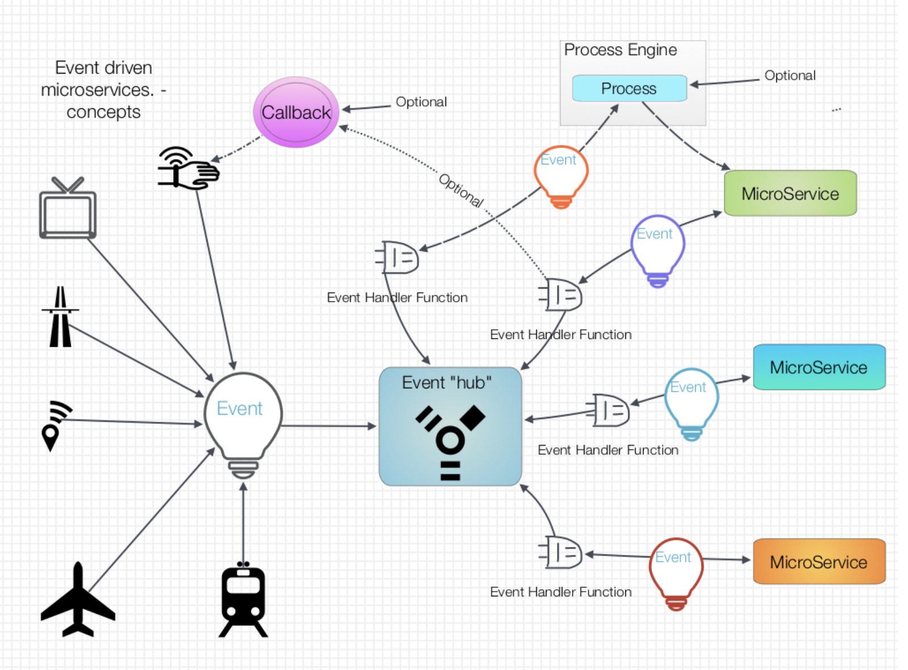
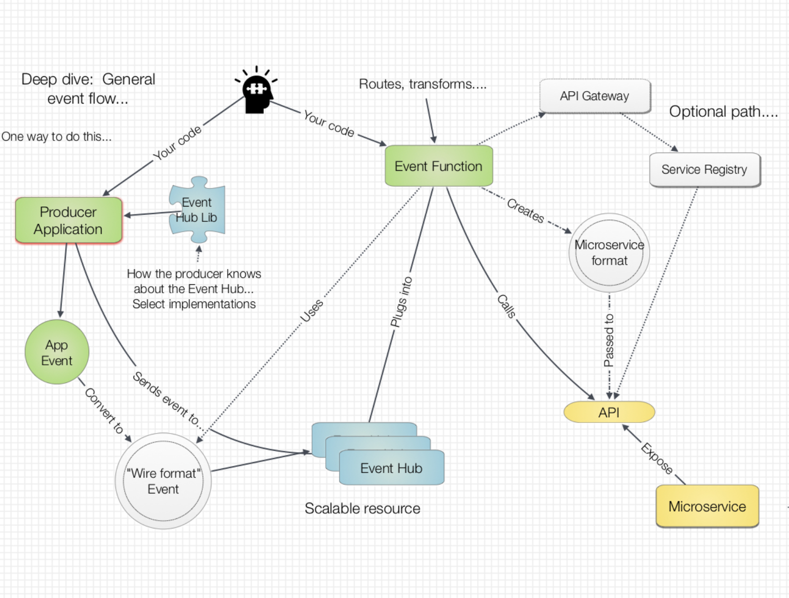
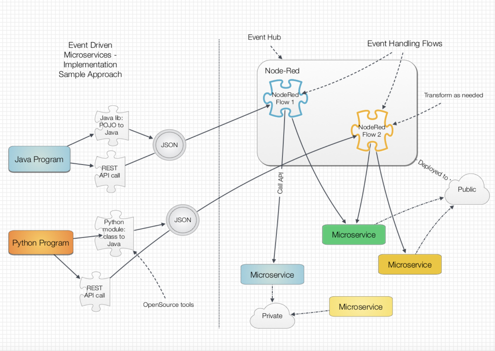

# It’s all about the events!!

__Original blog publish date: July 10, 2015__

So now that we have spent some time looking at scaling a microservices architecture, let’s get back to a more application architecture view. If you recall in an earlier post I discussed how the concept of choreographing the execution of microservices. In that post I referenced the use of a tool such as NodeRed to drive microservice API calls in a process driven architecture. However, this is not the only way to leverage microservices in an overall solution.

( teaser: yes I’ll look into usage of tools such as AWS Lambda later in this post)

## Events
Several years ago I started to frame my discussions with clients around this theme: ” Process Driven, Event Enabled, Loosely Coupled, Services Oriented Solutions“. As the last item suggests this was during the hype period of SOA. You will notice that even ” way back then”   there was focus on events.

Why? Well frankly because and event driven architecture aligns with how real life operates. More often then not people, things, and systems generate events. You will notice that this sort of thing sounds a lot like the Internet of Things topic. 

Yes, this is true. In the Internet of Things, events are generated from things ranging from Fitbits to washing machines to jet engines. However, events are not unique to just things. Systems can generate events: for example ” policy exception”, ” New Invoice Received”, or “Log Entry Added”. In reality, if you look at life with the right lenses, you can see a lot of events. 

A little story : I was on a project many years ago and a member of my team was trying to explain why he should build a state machine. At that time I just didn’t get it. What the heck was a state machine. Well he went on to explain how systems could be viewed as events that triggered different state changes on objects and the state machine was the engine that ran these transformations. Once I had the “light bulb” moment, I never went back.

Where was I... Ok back to events and microservices. So they are a key aspect of a microservices solution, but what is needed to make these work? How could it be implemented? Is this all new? ( no it’s not)

## Let’s dig deeper...
### Conceptual View
When looking to implement events and event handling in your microservices architecture let’s look at some of the capabilities and building blocks required.

####C apabilities
1. Ability for a system to create and post events asynchronously without requiring extensive knowledge of the system that will process the event. Loose coupling.
1. Ability for a system to handle events without dependencies on the consumer.
1. Ability to convert event data from language specific, “heavy” formats to network friendly formats that maximize content AND performance.
1. Ability to pass data and metadata such that the information can be understood in context.
1. Ability to provide handling for exceptions.
1. Ability to apply logic to events coming through the event handler to perform routing, analytics, auditing, security, etc... Without compromising performance.
1. Ability to define transactional boundaries .( optional to enable rollback of related events)

#### Building Blocks
* Event producers: the system or device that produces the event
* Event definition: the semantics of how the event is defined. One can thing of a class definition... Or Java POJO, or JSON, or XML schema
* Event hub/router/bus: the scalable engine to which events are sent. This apples routing logic, logging, and executes custom event handlers that enable specific actions to be taken on events as they are received. For example, route event to a specific service provider.
* Event logger: the specific service that logs all events. This can be used for auditing or transaction replay. Note this could just be another microservice.
* Event handler ( function): this is the unique “plug” that is created by developers to perform specific actions on classes or types of events. 
* Service provider: this is the microservice that provides the services (I.e. Actions) that are associated to events. Per my story above, this could be the logic that transforms the state of an object, or entity based on a specific event.

##An Implementation View
OMG this is so cool! This must be all new. Right? Now that AWS has introduced Lamda, this must be the only way to do this right?

Well. No. The capabilities to implement this sort of architecture have been around in one form or another for awhile. Like many things out there there are generally two paths to take: roll your own or use a vendors solution. Oh and where possible leverage industry standards. Ok... What’s the catch?

Well first it is important to understand the general flow for all event enabled solutions. The sketch below highlights the key pieces that are used and the flow.

At the end of the day, there are a couple of key points:
The producer needs to be able to take information it has and format it in such a way that it can be sent, in a smart way, across the network.

* The producer (code) needs to know how to access the Event “hub” . This is where it is going to send the event.
* The creator of the event handler needs to be able to create a custom handler that can be added to the hub.
* The event handler needs to know where to send the event.
* The event handler needs to know how to format the event.
* The producer and event handler need to know what to do if something fails. I.e. An exception path. 
* The Service Provider needs to be able to understand the data provided to it. See related post. Somebody needs to enforce security and policies.

For the sake of brevity, I’ll stop here. These are some points to think about.

#### Roll your own
Now.. How do we do this. Well. There is the roll you own approach. Frankly, while this may sound hard, the tools and techniques are available and not as hard as you may think. Let me give you a simple example.

#### Use a vendors solution
The alternative is to use a vendors event processing engine. Historically, these have been packaged as software that you purchased and deploy on premise. Yes, they do exist. Frankly, this isn’t much different than the classic “pub/sub” enablement engines that have been around for awhile.

The key change that has been occurring recently can be centered on two words: cloud and scale. By deploying event processing and routing engines to highly scalable cloud platforms, application architects now have new ways to leverage event enabled microservices solutions.

This is where engines such as AWS Lambda or IBM Bluemix Cloud Integration or Flowthings.io services come into play. Some key things to watch for when looking to use a vendor solution such as Lambda.

1. Do you need to include a vendors library into you code in order to interact with it?
2. If it’s running in the cloud, will it connect with microservices on premise? I.e hybrid ecosystem
3. Will there be added costs for this?
4. How do you integrate this into you existing management and monitoring systems?
5. How do you test applications like this? Is there a test region?
6. What sort of lockin is occurring?

Given the available open source software, is it just as simple to roll you own? Given the availability of Apache Kafka and storm cluster configurations on Mesos and Docker, can one in fact do this without using a “proprietary” solution?

Remember, I believe you need to weigh just how much you want to be committed to vendors solution against how ready and skills are the people that you have that are implementing the solution.

I hope this brief review of events in a microservice architecture was helpful. Obviously there is much more that can be said. More than likely I’ll revisit this in future posts.
