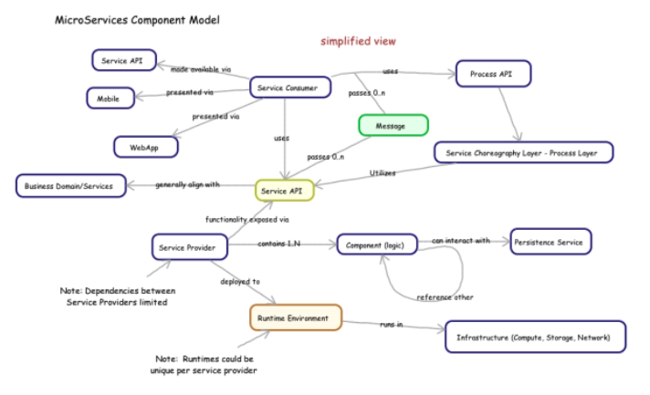
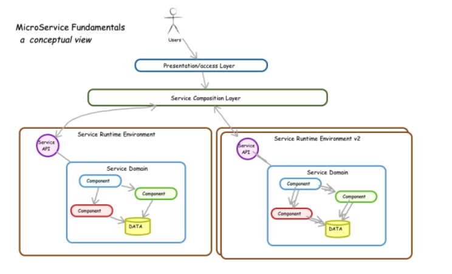

# A review of the fundamentals

__Original blog publish date: May,15 2015__

When looking at microservice architectures, where they have been and where they are going, it is important to have a solid foundation based on the fundamentals.

1. Functional logic is organized along domains,  not at a object level
1. All logic is accessed via APIs
1. Service Providers are deployed and versioned as independent units
1. Service Providers ( domain of functionality ) execute business logic related to the domain. This could include operations to process data entities ( CRUD ) and domain specific rules.
1. A separate “choreography layer” is commonly used to implement logic that crosses domains.  These “processes” are also accessed via APIs.
1. The end user has a number of ways to interact with all the APIs.
1. Persistence is managed at the Service Provider Level.
1. The messages passed to/from the providers are key to loose coupling.

