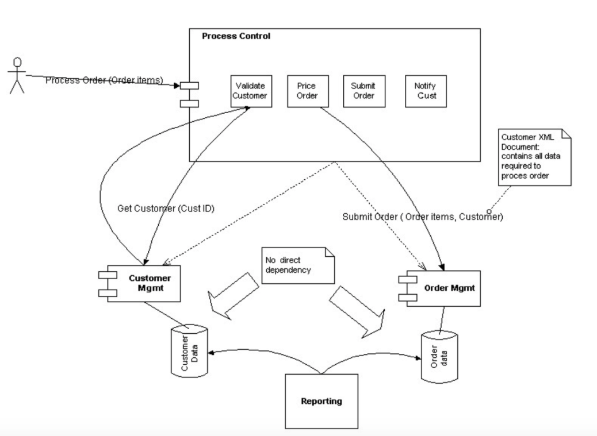
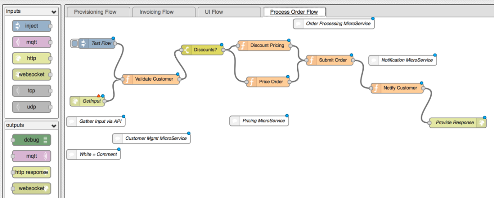

#  Who’s in control? Connecting the “Lego bricks”

__Original blog publish date: June 1, 2015__

## The Problem:

OK... so we developed all these cool micro services ( the “Legos”) and they are running in their on container. Cool. How do you connect them together?

Each of the micro service provides a set of services that implement functionality within the the domain of that micro service. Well, that’s all and good for that that micro service, but what about functionality or processes that includes services from multiple micro services? What capabilities are required to support this? How could that be implemented?

For those of you have designed and built distributed systems in the past this probably doesn’t look like a new problem. Your right, it’s not. That’s important to remember since the capabilities and issues are similar. If you recall, the need for a process control layer was covered in my paper that I dusted off that started me on this blogging journey. Remember this picture?

... a “legacy view”

## What capabilities are needed:
Given the problem domain, what capabilities are needed by such a control layer to implement such a solution.

* ability to define multi-step processing flows that can call REST APIs, build request messages, and process response messages ability to include business logic and decisioning criteria within the flow
* ability to support for various types of message payload types ( json, xml )
* ability to interface with various persistence services ( files, databases, etc... ) during a flow
* ability to create multiple threads in a flow.
* ability to be exposed as a REST API
low bar for entry: leverage commonly known languages with little external training
* ability to easily develop, test and deploy leveraging DevOps approaches and technologies
* ability to be triggered via a web based user interface and to trigger a user interface upon completion of a flow.
* ability to deploy and run flows both on premise and in the clouds

## What could be utilized:
So given that we know what is needed, what can be utilized to address the problem? In addition, what needs to be kept in mind? When one looks at the capabilities required I think it can be safe to say that the first reaction is: Hey that’s a workflow or process engine! Yes thats my perspective too. ( though it could be a state flow engine, which is different than a process flow engine) . So which engine could be used?

One could utilize an open source or vendor supplied business processing engine (e.g. IBM’s BPM engine ). While that has a lot of power, is a “cadillac” needed or can something more light weight be leveraged?

I propose that an open source tool such as Node-Red could be leveraged here. Node-Red is an open source tool, initially developed by IBM, to enable wiring together devices, APIs and online services. It is an extension to NodeJS and utilizes Javascript as the enabling language.

Each flow created in Node-Red would implement a cross micro service flow. A flow would be exposed as an API take in a request message, and provide a response message. The flow itself would implement the choreography to leverage various micro services to complete a business process or integration flow. The Node-Red flow would also include switching and control logic as needed.

Why is this a good fit from my perspective? Well, first its simple, lightweight, easy to learn, fast, and the flows can quickly be deployed to PaaS environments like IBM Bluemix. It also is based on an event driven, API model that aligns with the tenants of micro services.

An example of a flow from my original paper laid out in the Node-Red editor.

Isn’t Node-Red just for Internet of Things?

Yes, it is commonly promoted as an enabler for that type of solution, especially given it’s support for both event driven solutions, REST APIs and MQTT. But then again, a micro services architecture is a common implementation approach for an IoT solution. So yes, there is harmony, but no it’s not just for IoT solutions.

Let’s Recap. In this post I have summarized the problem, discussed some of the key capabilities required to address the problem, and I highlighted how Node-Red can be used to enable cross service choreography of logic. In my next post, I’ll get into more details of regarding the handling of data in this type of architecture.
