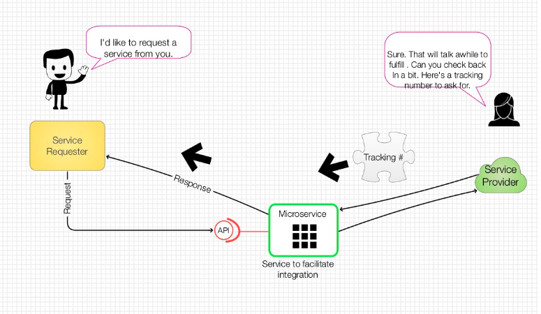
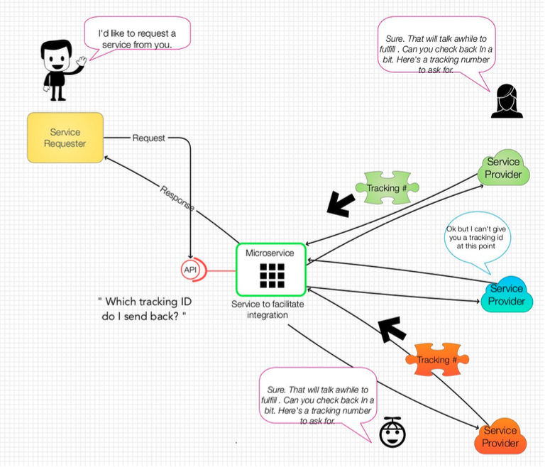
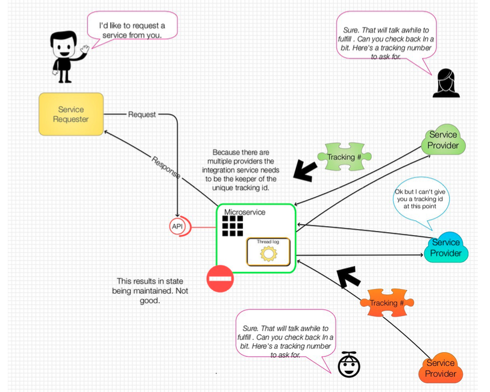
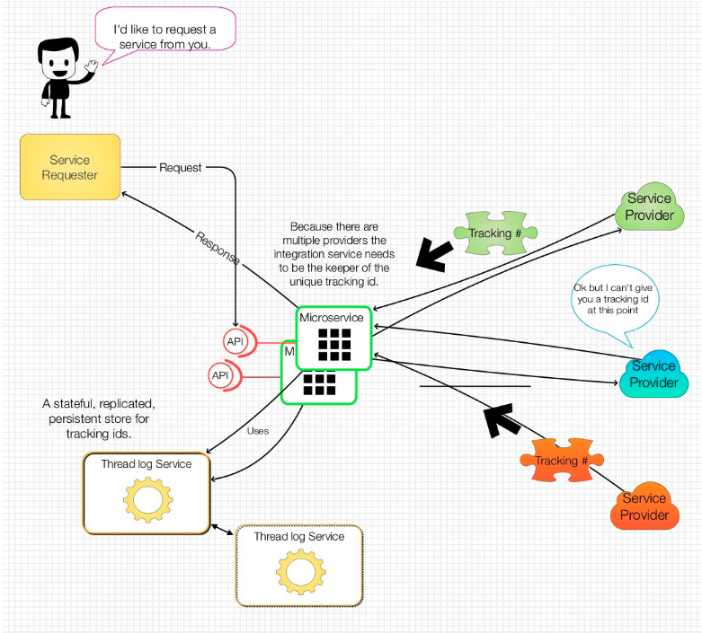

# Dealing with MicroServices that get put on “hold”...

__Original blog publish date: July 23, 2016__

If you have been a regular reader to this blog you may have noticed something lately. There has been a significant gap my posting activity. Yes, it has been several months since my last post. It’s amazing how quickly the day job can impact one ability to write blog posts on a regular basis.

The day job has taken its toll. On the flip side it has also provided additional insight into the challenges related to microservices. In previous posts I covered everything from events to logging to identifying instances of microservices. All of those have come into play in my recent work. The one thing I tripped across recently has been what if there is a need to maintain some sort of state in microservices.

Yes, I know microservices are not supposed to have state. However, I’ve recently worked on a microservice that served as an integration “layer” between a services brokerage and a set of providers. As we rapidly worked to build this, in an agile manner, I quickly required the need for a service that managed state. Yes shame on me. It amazing how quickly one can call into this trap even when you blog about not doing it.

How did I get into this position. Well one word. Threads. It turns out that the service consumer .. The thing that was calling me didn’t want to wait until I was done. Some things are so impatient. Hence.. This resulted in the fact that I, as the service needed to implement/leverage threading. Now that in of itself is not a major issues ( read Java servlet & threads or Ruby Sinatra threads ) . The problem came when I needed to send a thread Id back to the caller so that it could check back later. This meant I either needed to manage this information in my service, or I had to leverage some sort of “singleton” service to help out here.

Perhaps a couple of pictures will help. The most common scenario :

The simplest case, as represented by the following picture, is the case where a provider creates a unique “tracking” id for a service that is being provisioned. In this case, when a request comes in for an instances of a service, the provider returns this unique tracking id right away and then continues the provisioning a synchronously. This allows the service requester to not have to wait.. I.e. Block... Other requests . The service requester can using this tracking id to periodically check back to see if the provisioning is complete.

## Things get complicated?
So what if you actually want a service that is made up of calls to multiple providers that take a while to process. Who provides the unique tracking id? Who is responsible for managing this? This scenario really comes into play when the request is made up of services from multiple providers.

Well, the integration microservice can generate and manage this id. Then, when the requester calls back to see if all the providers are done with their parts, the microservice can respond accordingly. 

But how should this be done?

### Option 1
The first reaction.... The microservice could create and manage unique tracking ids. As reflected in the picture below the microservice would have logic to not only create a random tracking id to send back to the service requester, but to also store the current state of all requests made. Remember, the service requester is going to be checking back to ask the microservice if the provider is done.

Ok, here is the catch... This can work, but it’s not stateless.

## Option 2
A better way is to leverage a separate service that would be responsible for managing the state of the requests. In this scenario, each call to for a new service to one or more providers would be registered with this “thread” logging service. When a requester called back to make a status request ( I.e. “Is it done ?”), new requests would be logged against the thread logger service. Remember, we can’t just pass this through to the provider because I’m this scenario there are more than one provider.

This “thread” logging service would then be leveraged by all instances of the integration service.

Of course this architectural option does incur “incur” costs like any other. When you do this you now introduce added complexity
including a deployment dependency, potential costs for resources and manage, and if you don’t do it right, potential security risks. Obviously, this is a relatively unique scenario I’ve covered, but the general pattern is one I think we will find repeatedly.