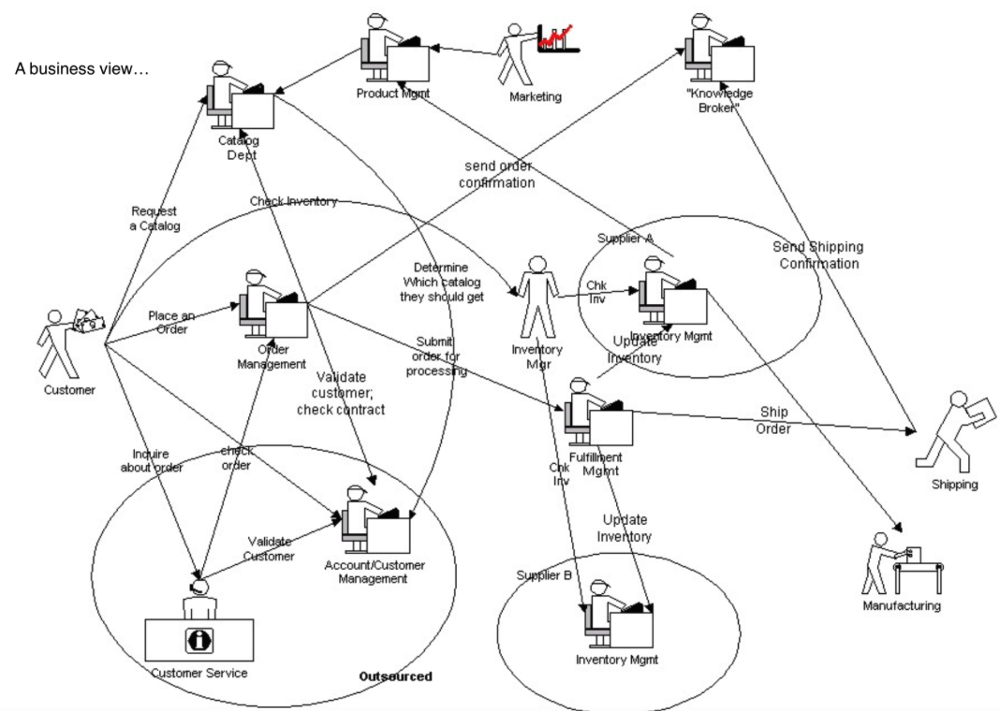
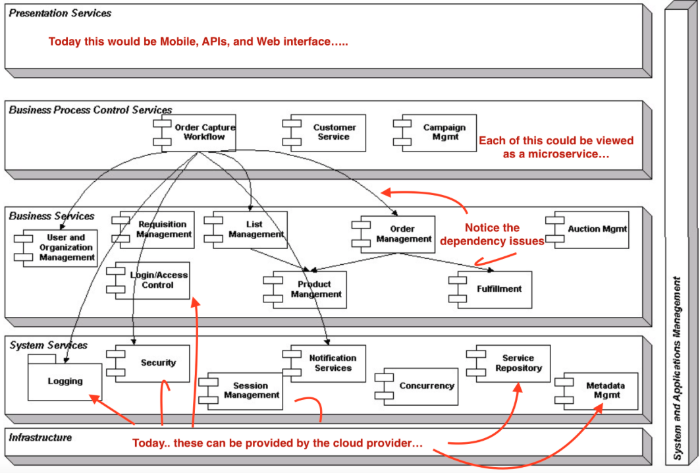
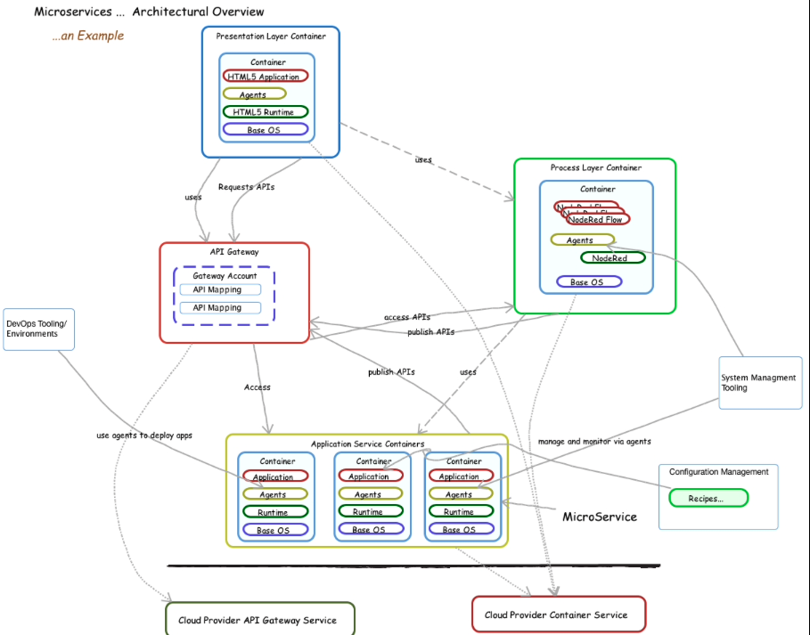

# Let’s start with the big picture view...

__Original blog publish date: June 1, 2015__

Now that I’ve set the stage with the “7 key things” I think it’s time to put some of these in context.
For this I’m going to resurrect a couple of the “classic” views from the paper I wrote awhile ago.

Again.. to put some context around this let’s look at the view of the business problem: An eCommerce business with lot’s of different departments each performing a selected task with information and requests passed to and fro.

When turned into a system component model, one can see how this starts to align with a “micro services” architecture. What historically has been viewed as course grained components, can be now be viewed as micro services. In addition, note that A couple of interesting notes when looking at this picture today:

1. this view represents 2 types of dependency management. The first approach has the process control layer (service) controlling all dependencies. The second, has some built in dependencies ( see the linkage between Order and Product mgmt.) For now just take note of this. I’ll be getting back to this later.
2. you will notice that many of the services I flagged way back when as something that the product needed to provide are now some of the services that cloud providers offer.
3. There is no service bus or API Gateway in here. This could cause issues, again that I’ll discuss more in later blog posts.

OK.. so how would a solution, that leverages the “7 key things” look like today. Well, let’s take a look at a simple, sample, overview. This is one way to view how the capabilities I discussed could be applied. Obviously, there are different ways to connect the pieces. Like I said, I’ll dig into this more in subsequent posts.

