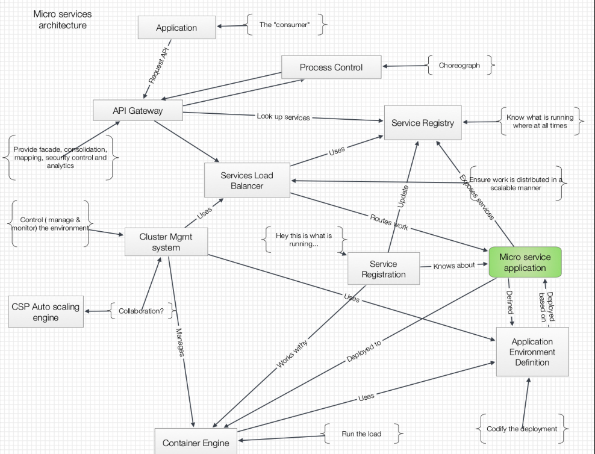
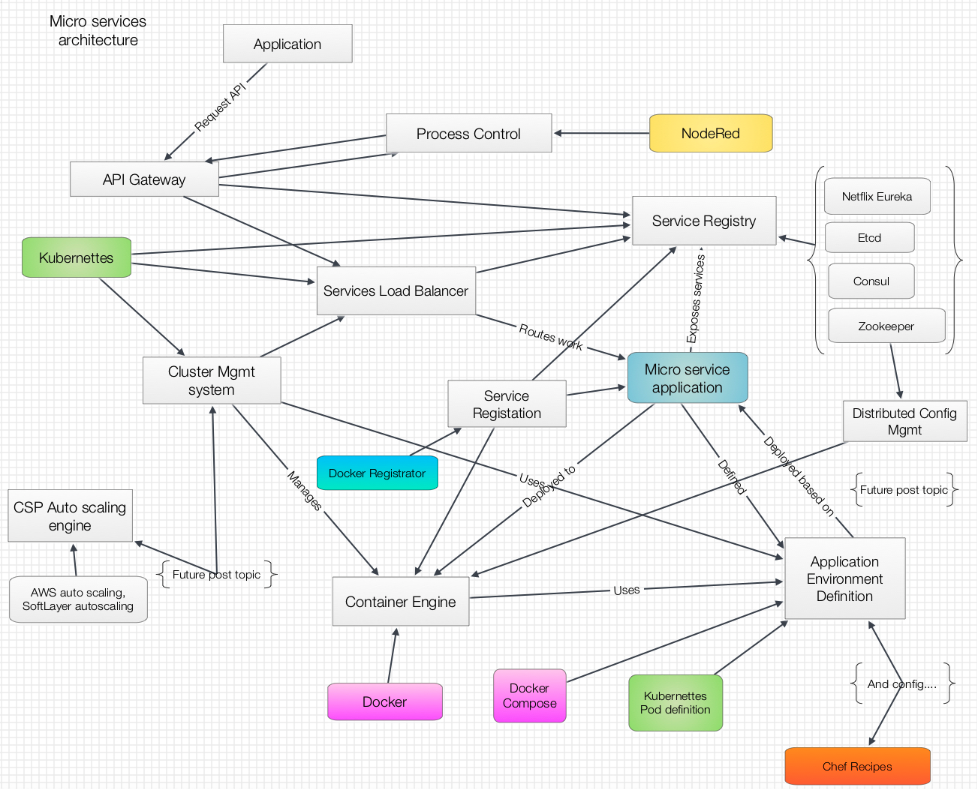

# Ramping up: Scaling Microservices – connecting the building blocks

__Original blog publish date: June 27, 2015__

If you have been following this blog you know that in past posts I’ve touched on the ecosystem that can enable microservices and some of the nuances related to developing microservices applications. For this post I’d like to revisit the enabling infrastructure level. Specifically, I’ll explore some of the enabling “Legos” and how they fit together to provide a ” living, breathing” microservices architecture. An architecture that scales up and down.

You’re probably saying to yourself, I already know about Docker, or Kubernettes, or Zookeeper. Your right, you can find a treasure trove of YouTube videos, blogs, etc... On these topics on the Internet. My goal I this post is not to duplicate that fine work, but to try to help provide a view of how the elements relate and look when laid out in a conceptual component view and a component realization view.

## Looking Back
Before looking at “today and tomorrow”, I’d like to take a short look back at how this was done in the past.
Creating distributed, scalable transaction oriented systems is not a new thing. Over the last few decades various vendors have produced frameworks, tools, suites, etc... To enable solutions with many of the same capabilities I outlined in my earlier posts. Often these were built by one vendor leveraging proprietary engines with sometimes proprietary languages. There was adherence to standards, or defacto standards, but that often was focused on lower ends of the stack, such as network protocols or transaction processing standards ( e.g. XA ). Examples of these include Forte’, as I have mentioned, Tuxedo, and even IBMs venerable CICS.

Granted we really didn’t think of these as true “microservices” solutions, but if one put on the right rose colored glasses they could support it.

## Today and Tomorrow
Ok... Now that we have looked back for a bit let’s pick up the story again. What’s new? What we are seeing I the last few years and today is the power of the open source community at work. As I have been building out my updated perspectives on this recently I have seen the synergy of a number of various initiatives occurring in the open source, and vendor supported communities. The Legos are starting to come together.

Don’t get me wrong, one should approach this with an eyes wide open perspective, but many of the capabilities developed by large born in the web companies such as Netflix, Google , etc.. Are now making it into a strong open source community. New energy is being applied and the pace is dramatic.

Key initiatives, such as containers and the capabilities that Docker is bringing to bear are transformational in the enablement of microservices. They are also transforming the cloud space, specifically IaaS and PaaS. They are raising new questions in terms of scaling: just where does a cloud providers auto scaling come into play when Kubernettes is being used to manage container clusters? But I’ll save that deep dive for later.

Again, it’s not just one technology. The power really shines when they are combined together in a solution to support a highly scalable, globally deployable ecosystem to enable microservices applications.

Just keep in mind ... The space is changing rapidly and there are multiple related efforts that do appear to be addressing the same space. Who will win? How do they relate?

## The goal:
Now that I have look back, and brought us forward let’s dig deeper into the types of Legos needed and a view of the actual implementations of these building blocks.

This is really a story of dynamic, adaptive, hybrid, scaling. Think I put enough buzz words in there? Let’s say my goal is to enable my existing business with an ecosystem that can support the deployment of new business functionally that can

1. change functionality ( and the interfaces) daily or weekly with minimal red tape
2. Add or remove capacity based on business traffic and volume
3. Quickly leverage the latest technology
4. Enable simplified, automated operations,
5. Enable new “Legos” to be added at will without have to redeploy others
6. Enable movement of Legos to public clouds, off premise private clouds, and on premise environments ... All without “an act of
congress” and a trip back to the “funding well”
7. Operate in a secure, transaction controlled manner where the business needs of audit and rollback are not forgotten
8. And... Support end users, aka customers, in the way they need to and want to interact with the system. This includes mobile,Event based ( I.e. Internet of things), traditional web, etc...

## The key building blocks
Before looking at a graphical view, for those of you like me that are saying, show me a picture!, l still look the major building blocks, or components, that are typically required.

* API Gateway services: Enabling facilitate secure access to dynamic interfaces and to have a measurement point into a microservices ecosystem.
* Service Registry: Enabling the tracking and ” directory” of those services and the nuances of how they work.
* Cluster management services: Enable a group of resources as a unit and scale them accordingly.
* Container/virtual machine engine services: The actual runtime for the micro service.
* Configuration Management Services: Enable a simple, consistent record of how each piece and the overall solution should be configured. Primarily the runtimes
* Services load balancing services: Enable dynamic routing of work to services that appear and disappear.
* Service Registration Services: Enable the bridge between micro services that start and stop dynamically and a Service Registry that needs to keep track of them. What’s running? What isn’t?
* Process Orchestration services: Enable logic based coordination of micro services
* Application environment definition services: Help to organize all of the various application building blocks into an nice simple definition that can be read by a human. AKA template, patterns, software defined blah blah....   Just help me to organize this stuff and treat that like code.
* Auto scaling services: Cloud Provide autoscaling engines that can start/stop resources as needed.

## An Architectural view

## A realization view(s) of what can be applied
Now, as this post is getting a little long... Let’s jump to the heart of the matter: where do all these new technologies fit into this?

The tools :

* Docker
* Docker compose Kubernetes
* Docker Registrator Consul
* Etcd
* Zookeeper
* NodeRed Application definition
* Docker file
* docker compose file Kubernettes Pod Defn Chef Recipes

## A Realization view

##Challenges remain

Suffice it to say, as the saying goes, “Instructions Required”.

It’s not a simple (yet) as just installing the capabilities and tools defined above and then deploying any old application to it and wa la... You have a scalable microservices application.

There are, and will continue to be technologies to be understood and decisions to make. There will be skills to be gained and retraining required. New “best practices” will have to be learned or relearned. However, the key point is that it’s coming. Understanding what is possible and how this can all work in conjunction with the systems in place today is critical to understanding the possibilities of transforming business, cities, governments
