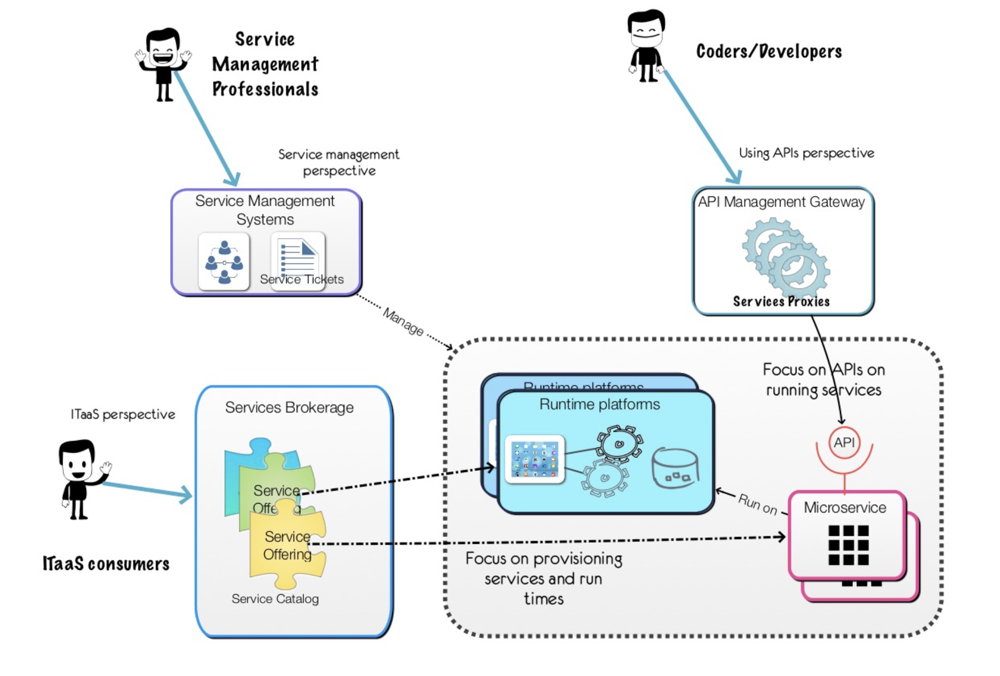

#Services Brokers vs Service Brokers: Whats the difference

__Original blog publish date: Dec 12, 2015__

A service is a service is a service. Well, not exactly. One thing I’ve discovered working in various areas of IT over the years, the same term can mean different things to different people. Context is important. Take the topic of a ” services brokerage “. If you recall in my previous post I referenced a “Microservices Vending Machine” building on a Cloud Services Brokerage. Well, based on some recent training I was leading I discovered that there are a couple of different perspectives here. In this post I’m going to review these to help clarify my perspective.

If you have follow my blog in 2015 you may remember I touched on this in the summer in my post “Shiny Objects: Services brokerages and Microservices“. 

However, I believe it is time to touch on this topic again.
I believe the place to start is to look at how different roles, or personas, see this topic.

First, lets start with the coders. Coders, aka developers, create software, and software today leverages APIs. Hence, they are looking for a way to find the APIs that are available for a particular need and to better understand which would be best for their need. To this group a “Service” is an callable API that a program or a REST client would access to perform an operation.

Next, we have the consumer of IT Services. Now, this is a broad term I grant you. This persona is looking to satisfy an ITaaS need that typically goes above and beyond a coding API. These IT Services are things you would typically find in a Services Catalog. For example they may be looking for the best backup service, or the best application runtime pattern. Remember my Microservices Vending Machine?

Finally, the third persona I’ve come across is, frankly, a subset of the previous. In this persona we typically have someone who has spent their life in IT operations and views the world from the lense of services tickets. Things that an IT services organization does for based on requests ( I.e. Tickets)

So, to the first group, a Services Brokerage can be viewed as an API services gateway or services proxy. I this world Service, think APIs, are registered with this brokerage. This Services Brokerage then is accessed by developers OR by code to find the best API to call. In the case of the later, code looking to perform an operation and the brokerage will leverage policies and/or preferences to find the best choice and co plate the call. Can you envision the old fashion telephone switchboards in action? Just make sure the ” plug” fits

To the second group, a Services Brokerage is a system the does a couple of things. It provides and manages a catalog of IT as a Service Offerings, and it provides the capabilities to help you choose these based on factors such a fit for purpose, cost, etc... Again these services represent offerings ranging from IaaS offerings from multiple on-premises and off-premises cloud providers ( compute, storage, networking), PaaS offering such a object storage, pre-packaged run times, etc...., or SaaS offerings that are fulfilled by off- premises providers. In addition, these services could be delivered automatically or manually. Something you really don’t envision with an API. You can see here that while there is a relationship here in that APIs need to be used the scope of what is being brokered differs.

Finally, the last group. Remember this group is the team that has been historically responsible for keeping the lights on. They see service has things that their organization has performed, as a service, to an organization for the on-premises systems. For example, provision servers, manage backups, provide server config and audits based on policies. They are typically running under a contract to do this work. So their scope of services is typically not as comprehensive as the previous paragraph and they sometimes see themselves as the broker to select the right offering based on the contract and policies. Hence they are the Services Broker.

Has you can see understanding the terms and perspectives is key when looking at Services Brokerage. From a microservices standpoint, what the broker would be ” vending” differs. Based on my experience there is a need for different vending machines for different types of offerings.
