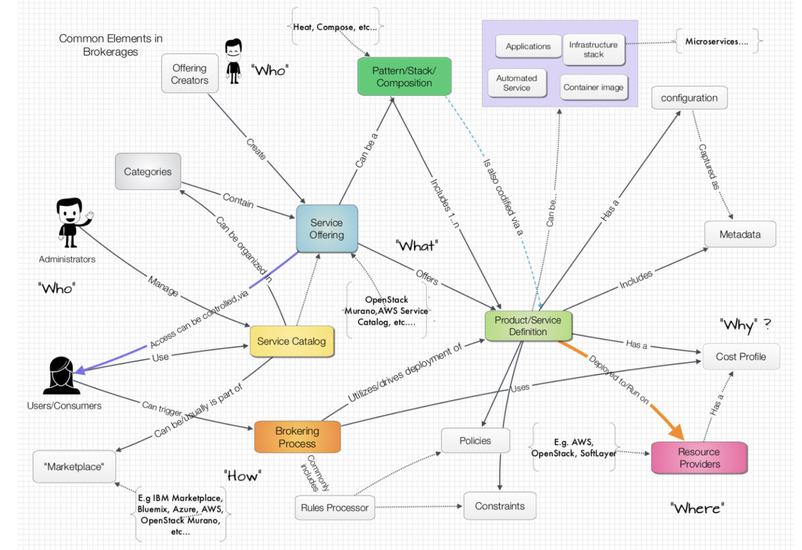

# Shiny Objects: Service Brokerage and Microservices

__Original blog publish date: July 29, 2015__

Anyone who has been in the IT field for any period of time knows that there is no end to new terms, new usages to old terms, and new “shiny objects” that get our attention. Two of these that are in the news lately include “Service Brokerages” and “Microservices”. I’ve covered Microservices extensively in my posts, but in this post I want to touch on brokerages and some relationships with microservices.

You will notice that one word comes up repeatedly in the previous paragraph – “services”. It’s interesting to note how this means different things to different people with different backgrounds. If you are an application architect the first thing that pops to mind can be application services. Think SOA, REST, APIs etc... But if you are an infrastructure architect with a focus on managed services , you thing of service offerings that are provided to customers. For example, a backup service, provisioning service, cluster management service, etc...

In the world of service brokers, these different perspectives can come together along a set of use cases. In this post I’ll provide a view that I have developed to structure a message that you could use to sort this out for yourself and for others.

Before I get into that I want to review some key points to lay a solid foundation.

* First, there different types of services brokerages that provide different capabilities. In some ways the “service brokerages” also align with how different people view services, as I discussed earlier.

* Second, there a set of core concepts that apply to all types. Understanding these elements and the relationships helps to see the commonalities and differences.

* Understanding how your Microservice architecture aligns with the use cases determines the brokerage capabilities required
* It is important to understand the differences in approaches for Distributing Microservices

## Use Cases
To understand anything today, a common approach is to put together a set of Use Cases to shape a story that people can latch onto. So, I have put together a few below. Depending on your role you may be saying the following:

* I have an application that I want to be dynamically scaled. But how do I do this without paying for worse case scenario?
* I have an application that I want to move to the cloud... But I don’t know which cloud to use, what are the costs, and what should I watch for.
* I have an application and I want to connect it to services that are already available in the cloud. But which service should I use? I need a specific solution environment stood up for my needs. But where should I do this given my needs and budgets?
* I need specific compute, storage, and/or networking resources to be provisioned But how do I know which providers to use given my needs and budgets?

## Implementation Perspectives
Given these use cases let’s look at some perspectives as to how service brokerages can be categorized, at least from my perspective

1. Application Capacity Services Brokerage
2. Application Package/Environment Brokerage
3. Application Services Brokerage
4. Infrastructure Services Brokerage

### Application Capacity Services Brokerage
In this perspective the brokerage takes 3 core elements: the application configuration, the policies and constraints, and available resources it knows about and determines where components ( think Microservices ) can be deployed. The focus here is deploying an application to a cluster of resources and throttling it up or down based on traffic, capacity, etc...

There are 2 sub use cases that might help you internalize where I am going with this.

One could look at it from a pre-deployment perspective: “I’ll take a look at your application configuration and profile and based on available providers, capabilities, and cost I’ll provide guidance as to where it should be/ could be deployed. “

Or a deployment perspective: “I’ll take your application configuration and figure out where to place it based on the information I have on a known set of resources ( i.e. a resource pool). Once I have deployed the application, I’ll keep an eye on it and scale it based on the policies and constraints you have provided me.”

The later is typically implemented today using open source tools such as Apache Mesos or Kubernettes from Google. Now, I know one typically doesn’t think of these as brokerage solutions. However, they do provide a set of the common brokerage services. If one were to extend them to include logic to process cost constraints then I believe the fall in to this category.

This type of solution typically includes ongoing management, monitoring, provisioning, de-provisioning , of resources to support traffic volumes.

Autoscaling as provided by cloud providers is on approach used to support this but more advanced needs require a dynamic application environment.

### Application Package / Environment Brokerage
Looking at this perspective, The role of the broker is to take a pre defined environment package and match the type of environment, it’s characteristics, capabilities required, organizational policies, with available resource providers to select and deploy to the best option.

From a sub use case perspective:

“I have a specific Application Package and I need it deployed where it should best go based on policies, constraints, costs, etc. ...”
The actual process for doing the deployment can be executed via a “let me choose from a catalog” approach to more of a “guided selling” approach.

In this case a “Package” equates to a set of things: i.e. a pattern, a stack, ... Examples of this include definitions one commonly finds in Docker Compose, OpenStack Murano, AWS Service Catalog, IBM Marketplace/Cloud Orchestrator, Scalar, Gravitant, etc...

The broker needs to have a clear understanding of the resources available in the selected environments, along with cost perspectives so that it can make the right choices given cost policies and constraints. Given a specific application environment, provision that environment on the platform/resources that make sense based on workload, policies, and constraints.

### Application Services Brokerage
Getting back to a more application perspective, there is another form of “brokerage” that can be defined. This type can best be viewed by looking at another sub use case.

“I need a specific type of service. I want the best fit for the job given my constraints, policies, capabilities... but I don’t want to have to hard code myself to it. i.e. make it as easy as possible for me. Can the brokerage help me find the best implementation and deployment of a service to meet my needs? “

Ok... So what is a service in this case? Frankly, from my perspective a service could range from a managed service, e.g. Backup service , to a service providing a NoSql DB, to a distributed log management service, e.g Apache Kafka. In effect, this type of brokerage builds on the capabilities of the application package brokerage while enabling the capacity services broker.

Let me see if I can clarify with an analogy. In the previous perspective we, the user, have selected a specific package that we want to standup, let’s call it your ” model home” . We know what we want but we don’t know where it should be built. That’s the key word here – “built”. Alternatively, let’s say we are just looking to move into something that is already built, or available. That’s the primary focus of this perspective. In this case, the brokerage is helping to find available services based on your needs, policies, constraints.

### Infrastructure Services Brokerage
If your following my train of thought here you can probably guess what is coming next. If your background is primarily in IT Operations you commonly get requests for typical compute, storage, and or networking resources. Historically, you did the actual stack and connect in your data center. With the cloud you, or the actual requesters simply make a request via a specific cloud provider portal ( e.g. AWS console, SoftLayer portal, OpenStack, etc... ) . The infrastructure services brokerage is a value add between the users/consumers and the providers. Really, the only difference here from the previous perspectives is that in this case, it’s primarily focused on the IaaS space. The Infrastructure Services brokerage is targeted at supporting some of the following sub use cases:

” I need to have a Ubuntu platform with local storage and network storage that includes Autoscaling capabilities for a specific region while also providing managed backups to a storage area that is not in the same data center. Oh, and it needs to fit into my organizations budget constraints. ”

Now, you’re probably asking yourself... What does this have to do with microservices? Well, it’s a stretch I agree. But I thought it important to include this here to ensure proper coverage.

## What does this mean the you?
Well.. at the end of the day two key things come to mind. Make sure you understand the elements, the different variations in how terms can be used, and what capabilities you need when determining how a broker relates to your Microservices architecture.
