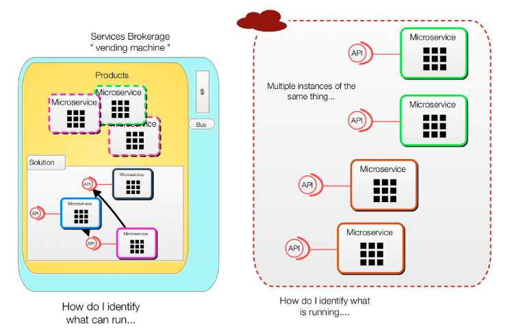
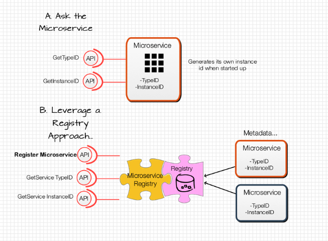

# Microservices SKUs and Serial Numbers. How do these relate again?

__Original blog publish date: Feb 22, 2016__

## The what

In the past I’ve blogged about a number of different perspectives related to microservices so this time I’m going to try to connect a couple of these. Remember my blog post about a Microservices vending machine? How about my recent one about events and microservices? What’s the connection? Well at the end of the day there is one commonality: how do you identify the microservice at the “product” level and at the instance of the microservice. Remember ... There are scenarios where you can deploy and run multiple instances of the same microservice at the same time.

Here’s an analogy for you: Having spent a fair amount of time supporting retail IT solutions I find a very similar problem set. In the physical world products have Sku’s to identify the types of product. For example there is a sku for the iPad I’m writing this blog on. In addition there are also serial numbers for EACH iPad.

I submit that if you are to build a microservices vending machine and a event logging/store system you need both of these. You will need to think through how you want to identify the types of the services. Like other things this probably will need to be a code or Id to facilitate processing by systems. Of course this also needs to be unique. I bet you asking so what? I really don’t need this. Consider this... If you are tracking who ordered what, how will you know what microservices have been ordered? When looking at event logs, do you really want to have to include all meta data details of a microservice?

Like the retail world, having a unique way to identity a type of microservices also can help you to “bundle” or group these together in unique ways. So if you are thinking of a type of microservice architecture that includes such a “vending machine” also consider the need for a ” product management” service to manage information on your services.

Ok now let’s look at the instance Id . Remember the serial number? Yes, if you are going to try to associate events to where they came from you probably need to have some sort of serial number. Yes this is more to manage but consider this; like the physical world there is a reason for this. It will help you provide a more comprehensive audit history and also associate different events or state changes together.

## The How
Ok we have taken a quick ( ok extremely quick ) look at the problem space. Before we get into some options, let’s review what I submit is needed.

1. An approach, an probably a mechanism, to uniquely identify a type of microservice.
2. An approach, and yes a mechanism, to uniquely identify an instance of a specific type of microservice.

Now let’s discuss some thoughts on how this can be done. I submit there are primarily three ways to do this:

A. The microservice is developed to manage its unique I’d ( I.e. Sku) and instance I’d. If someone, or something.... That would be software.... Wants to know this information it would ask an instance of the microservice for its “sku” and “serial number”.

B. At the other end of the spectrum there could be “registries” that run in a specific environment to manage the metadata on microservices , I.e. The SKUs, and instance information, I.e. The serial numbers. In this option, all me microservices would need to be registered with the registries when they are made available for use and when an instance is created.

C. Well this would be the age old concept of compromise. The microservices would have the smarts to report information they know about ( i.e. Their metadata) , and they could generate and register a unique instance Id. However, there would still be a registry service used to support the requests for information, I.e. Lookups

Obviously this is only a small part of a broader microservice vending machine/ event store solution, but I believe it is an important one to consider.