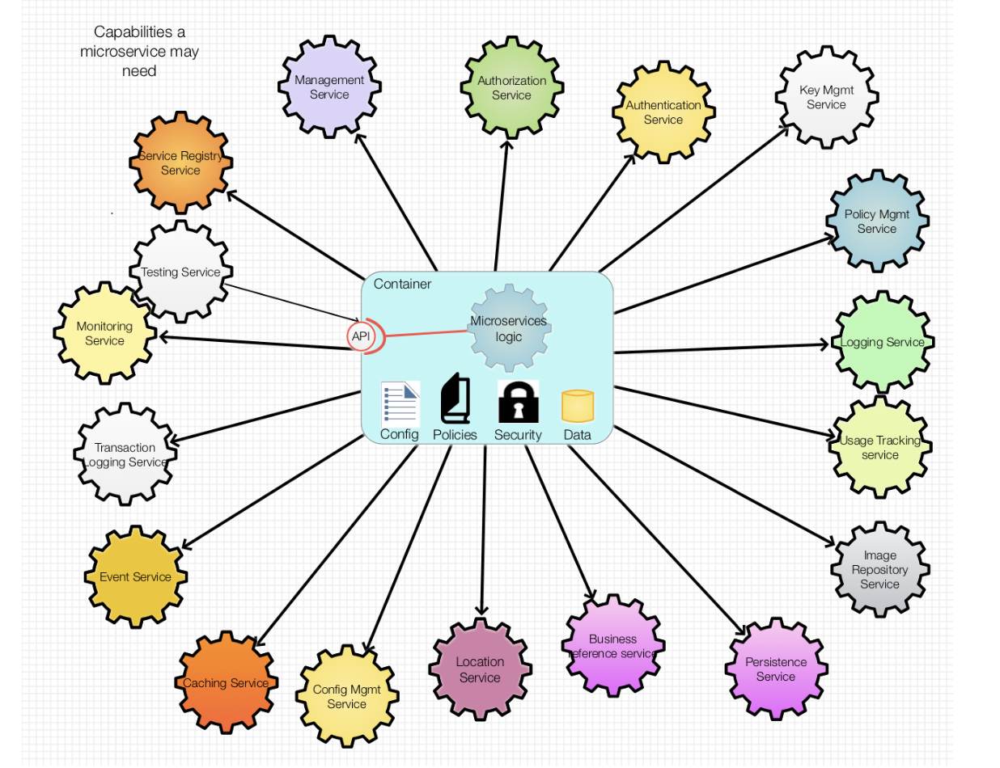
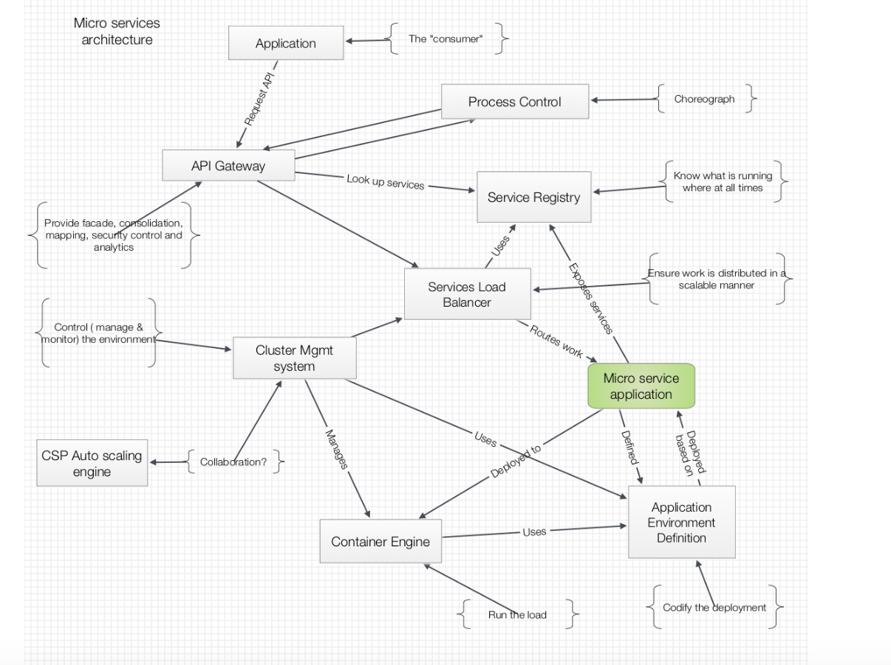

# Microservices: What’s the utility infrastructure look like?

__Original blog publish date: Sept 10, 2015__

So recently I completed a couple of microservices. No big deal. One microservice provides cross cloud ( AWS, IBM Cloud, and OpenStack) cost aggregation. The other provides enhanced tagging services that monitors provisioning processes occurring in IBM Cloud Orchestrator (ICO) ... (**Yes.. these is an old product...**). It also adds additional tags to the compute resources in the clouds. This is done so that the resources could better be associated to the service offering that drove the provisioning, and the project that owns the resource.

I don’t really start out with a goal to create a Microservice. Rather, I was more focused on finding a way to provide the required services in a way that would be loosely coupled and could be developed and tested without affecting my service consumer ( in this case ICO and a JavaScript dashboard). My goal here was to iterate and keep enhancing the functionality behind the APIs (REST of course   ) such that as I discovered things I wouldn’t break my service consumers.

Where am I going with this? Well, as they say ” talk is cheap”. As I got into this I started to run into common architecture questions like; How was I going to cache the information being returned for quick retrieval?, How could I do logging? And this is only the beginning. I
touch on more later. Now... full disclosure, I didn’t solve all of these in the best manner. Where I had to, I used simple Open Source solutions, and packaged them in the same container. It would have been great to deploy this to a platform that already provided solid set of services that I could readily use. But what are those services that a microservices platform should provide?

In this post I’ll review some thoughts as to could be needed. I’ll draw on my experience not only in this recent effort, but what has been done in this area of service oriented loosely coupled apps over the years. ( remember where I started this blog   )

Note I’m not getting into the “how” yet... Just the what. I’ll get to the how in the next post.

## What’s different

Before I go into a look at the foundational services required, let’s review what’s different in a microservices world from how apps have been built for millennia.. Ok.. Not millennia. But it did sound dramatic.

Applications traditionally have been pretty tightly coupled. Yes there’s SOA... But at the end of the day many of the core reusable code services an app used were packaged in libraries and compiled with the code. There just wasn’t an easy or practical way to access the services as “utilities”.

## The foundations: what are some of the core capabilities
Lets look at this from a “common questions asked” perspective... Questions:

* How will I get a current view of the collection of Microservices in a solution?
* How will I enable a consolidated log view across a set of loosely coupled micro services? Where do I register my Microservices APIs so that they can easily be found?
* How can I get a sense of how my micro services are running?
* * How can I manage the configuration a set of Microservices?
If I need to listen for events for different sources, is there one place to listen?
* Is there someplace I can use to cache information without having to create my own? What if I need to store something? Do I need to create my own database?
* Can someone help me scale up when I need more copies of my micro service?

As you know by now I like to use pictures to share a perspective. So... for this I created the following picture that frames out a portfolio of potential services that such a microservices platform could offer.

As you can see, I’ve outlined a broad set of potential services that my micro service could use, and or need.

## My Point

Does every microservice app need all of these? Of course not. This is, to use another metaphor, a toolbox of services that could be required. Like your toolbox on your workbench, some of these tools are small focused things to do one job. Others are more comprehensive and can be tailored to support different needs (e.g. Persistence services) Some are called by, or plugged into an application, while others work in the ecosystem or platform that a microservice is running ( e.g. Auto scaling )

This may sound somewhat familiar. You recall in an earlier post I touched on some of these when I discussed Ramping up: Scaling Microservices – connecting the building blocks . The building blocks I discussed in that post are the but a subset of a broader set of capabilities that a microservices platform needs to provide.

So at the end of the day there are some key capabilities that are required to answer the questions I posed. In the next post I’ll take this conceptual view and try to put something concrete behind it.
(looks like I’m committed now... check back to see if I can come through or if I “fail fast” )