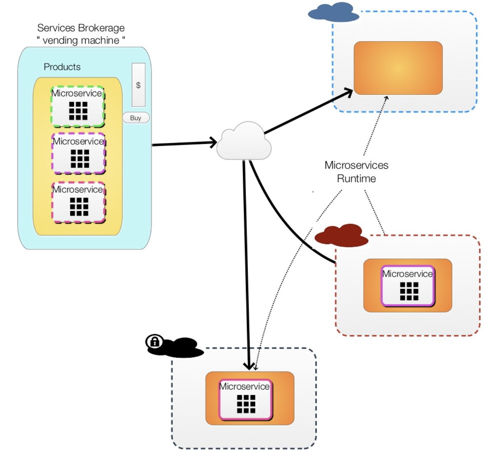

# A Microservices Vending Machine

__Original blog publish date: Dec 10, 2015__

Recently I’ve been actively involved in the concepts and technologies relate to cloud services brokerages. What’s that? Well I’m a nutshell its all about providing business and its users with two core capabilities : a aggregated view of available service offerings that are available to them across cloud providers combined with “smarts” to help users make the right decision based on cost, business policies, capacity, etc.. .

.. And then automatically provisioning these offerings. In essence its all about ITaaS.

Now the more I’ve gotten into this, and looked at available technology enabler options I keep coming back to the same analogy: it’s like eCommerce. Instead of going to your it organization for a cloud service, and wait for the traditional processes to be performed, you go to your organizations “services brokerage”, browse the catalog, place an order, and your choice is provisioned . Ok, it sounds like an enhanced service management system. Well, frankly, it could be considered the next turn of the crank on that. ... But the focus of this blog is microservices so let me cut to the core premise use of this post. If you merge the concepts of a cloud services brokerage and merge it with microservices what do you have: You have a microservices vending machine!

Ok, bear with me and let me explain where I’m going with this.

A cloud services brokerage is all about providing customers with a catalog of service offerings that, based on their organization, or policies, they have access to order and provision. In addition they can can be given the option to compare available offerings based on select criteria and choose the best fit, or the brokerage can make the choice for them based on policies. Sound like an ecommerce site? How about a vending machine?

Now let’s take it to the next level: if these service offerings are implemented as microservices, and packaged in a manner that they can be deployed via the brokerage, then you have a microservices vending machine.

Let me expound on this idea bit more. If we take the concepts of microservices to the nth degree, here’s what we have: each microservice is an codified implementation of a capability ( business, IT operations, etc... ) designed to operate in an independent loosely coupled manner. Taking it to the next level lets say we our microservice is packaged as an standalone, deployable application using containers.

So now we have a classic Lego block. An independently deployable application with well defined APIs . These “Legos” can come if the form of long running microservices perhaps ( with a UI or that run in the background ) , or one time services that are deployed, startup, do their task, and shutdown.

Ok, so now we have the “products” to put in the vending machine. But how does the vending machine know what these are? The answer is metadata. For this to work, each of these microservices ( Legos ) will need to have descriptive metadata associated with them. This metadata can provide information on the capabilities of the microservice, what it is dependent on, where it could be deployed, key events generated, etc..

So what? Let’s review. We now have independently deployable microservices that

1. can be categorized into a services catalog,
2. Be compared to similar microservices ( remember the catagories and metadata )
3. Be priced and ordered via a cloud services brokerage
4. be Automatically be provisioned leveraging the container packaging
5. Have its lifecycle be managed via the cloud services brokerage

Still with me on this? No? Well let’s keep going. I’m sure you will catchup. Remember that there is a test at the end of this. :)

Way back in the beginning of this post I talked about ITaaS. It we now combine the capabilities of a cloud services brokerage with a portfolio of IT Services implemented via microservices, such as monitoring services, audit services, health check services ( just for example) , we now have a microservices vending machine.

What’s the catch? Ok... You’re right this could work for nice simple services but what if these microservices need to communicate with one another, how do you keep track of what has been deployed and is running, and where these microservices are running? It’s one thing to fill the vending machine up and vend the resources but would a “platform” for these microservices look like? What are the challenges? If you have been a follower of this blog over the last few months you will noticed I have covered some of these topics in previous posts and in the next post I’ll combine some of the topics to dig deeper into exactly what this platform would look like given a Microservices Vending Machine.