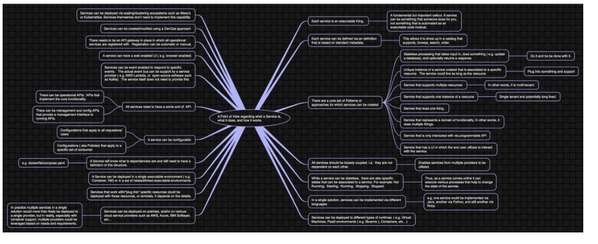

# A Microservice: what, how, where.... a Point of View

__Original blog publish date: Aug 3, 2015__

I was doing some brainstorming and I “mind mapped” out the following Point of View regarding what a Microservice is, what it does, and how it works. Feel free to lob your tomatoes. 

My Mindmap......

OK... for those of you who are squinting......

1. Each Microservice is an executable thing.
    1. A fundamental but important callout. A Microservice can be something that someone does for you, not something that is automated as an executable code modual.
1. Each Microservice can be defined via an definition that is based on standard metadata.
    1. This allows it to show up in a catalog that supports, browse, search, order.
1. There are a core set of Patterns or approaches for which services can be created
    1. Stateless processing that takes input in, does something ( e.g. update a database), and optionally returns a response. Do it and be be done with it.
    1. Unique instance of a Microservice created that is associated to a specific resource. The service could live as long as the resource.
        1. Plug into something and support
    1. Microservice that supports multiple resources.
        1. In other words, it is multi-tenant.
    1. Microservice that supports one instance of a resource
        1. Single tenant and potentially long lived.
    1. Microservice that does one thing.
    1. Microservice that represents a domain of functionality. In other words, it does multiple things.
    1. Microservice that is only interacted with via programmable API
    1. Microservice that has a UI in which the end user utilizes to interact with the service.
1. All Microservices should be loosely coupled. i.e. they are not dependent on each other.
    1. Enables services from multiple providers to be utilized.
1. While a service can be stateless, there are also specific states that can be associated to a service. For example: Not Running; Starting; Running; Stopping; Stopped.
    1. Thus, as a service comes online it can execute various processes that help to change the state of the service.
1. In a single solution, services can be implemented via different languages.
    1. e.g. one Microservice could be implemented via Java, another via Python, and still another via Ruby.
1. Micro services can be deployed to different types of runtimes. ( e.g. Virtual Machines, PaaS environments ( e.g. Bluemix
), Containers, etc...)
1. Micro services can be deployed on-premise, and/or on various cloud service providers such as AWS, Azure, Google Cloud, etc...
1. In practice multiple services in a single solution would more than likely be deployed to a single provider, but in reality, especially with container support, multiple providers could be leveraged based on needs and requirements.
1. Microservices that work with/“plug into” specific resources could be deployed with those resources, or remotely. It depends on the details.
1. A Microservice can be deployed in a single executable environment ( e.g. Container, VM) or in a set of related/linked executable environments.
1.  A Microservice will know what is dependencies are and will need to have a definition of this structure.
    1. e.g. dockerfile/compose.yaml
1. A Microservice can be configurable:
    1. Configurations that apply to all requestors/users
    1. Configurations ( aka Policies) that apply to a specific set of consumer
1. All Microservices need to have a some sort of API.
    1. There can be operational APIs: APIs that implement the core functionality.
    1. There can be management and config APIs that provide a management interface to running APIs.
1. Microservices can be event enabled to respond to specific events. The actual event bus can be support by a service provider ( e.g. AWS Lambda, or open source software such as Kafka) . The service itself does not need to provide this.
1. A service can have a web enabled UI ( e.g. browser enabled)
1. There needs to be an API gateway in place in which all operational services are registered with. Registration can be automatic or manual.
1. Microservices can be created/modifed using a DevOps approach
1. Microservices can be deployed via scaling/clustering ecosystems such as Meso’s or Kubernettes. Services themselves don’t need to implement this capability.

